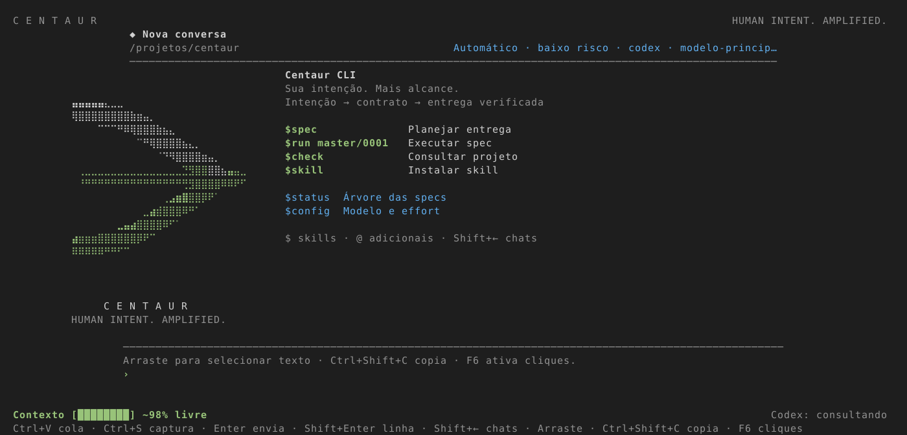
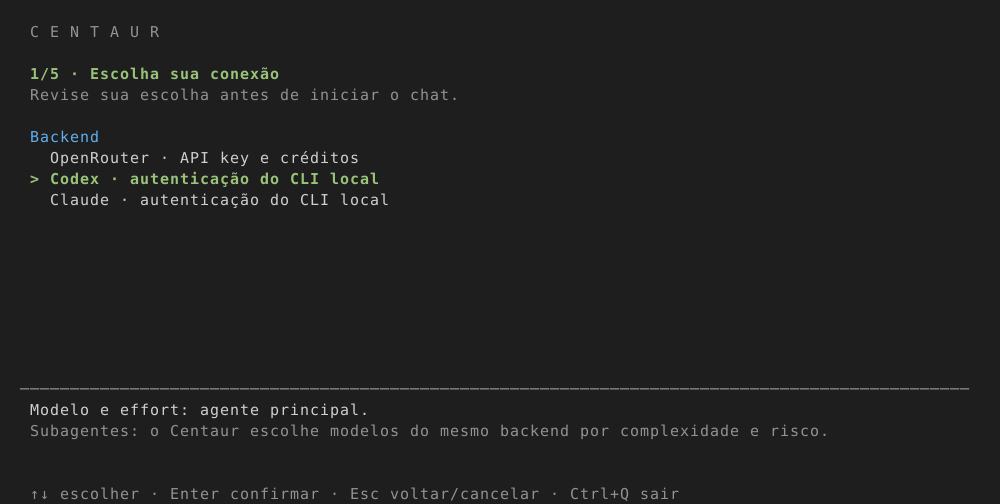
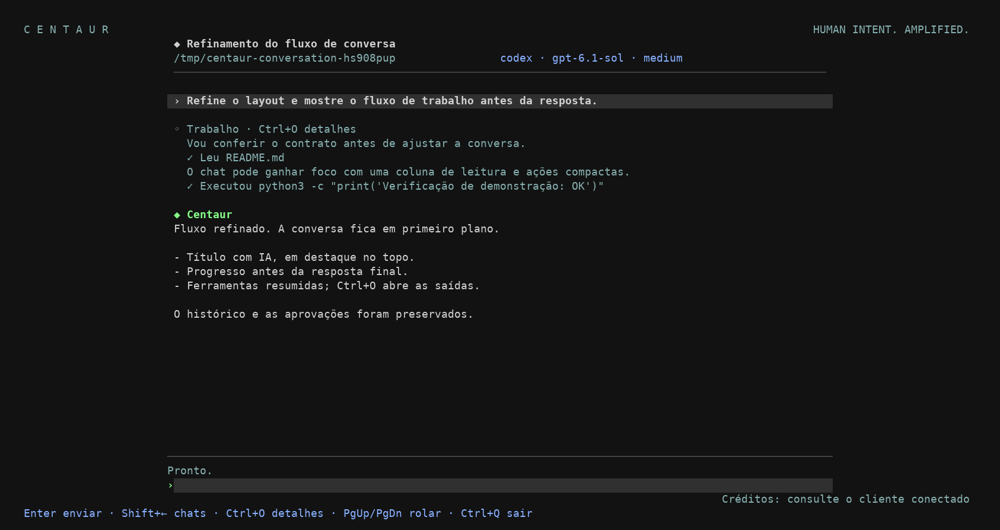
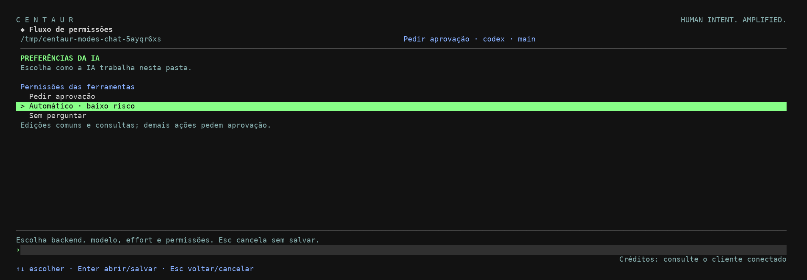
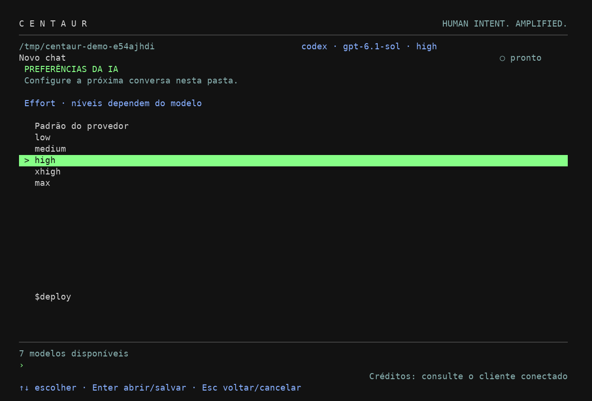
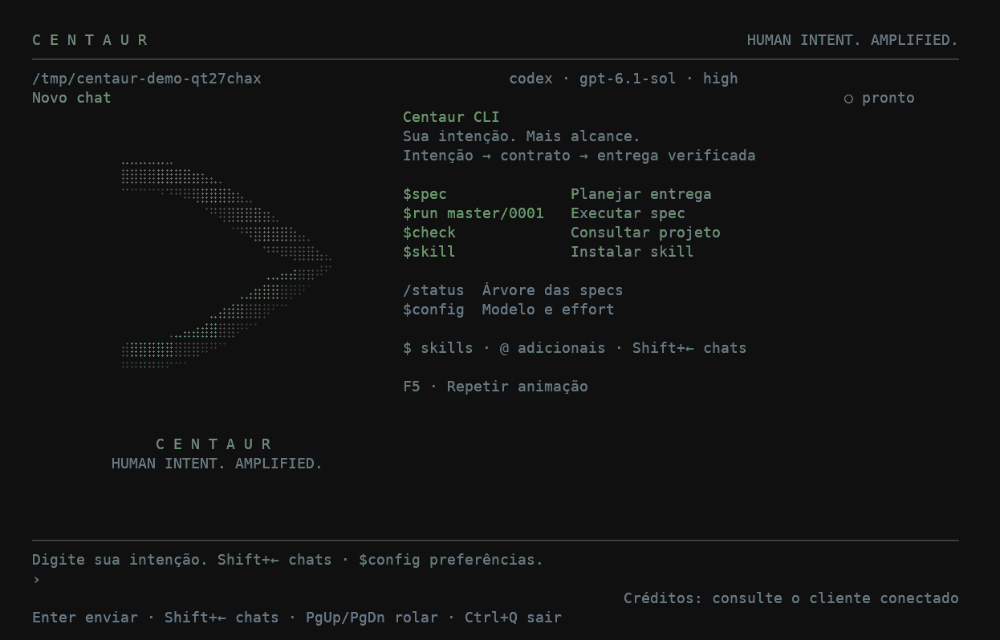
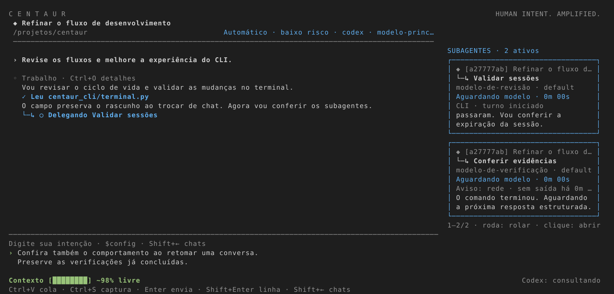
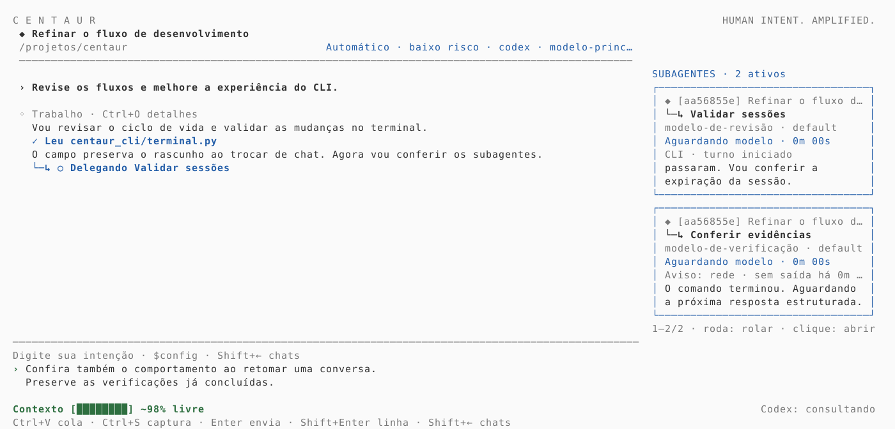

# Centaur

Harness de skills para guiar Codex e Claude Code pelos projetos, com uso principal no terminal. A IA coordena o trabalho; o humano define comportamentos e limites. Specs organizam entregas, contratos definem o aceite e evidências permitem conferir o resultado.

## CLI com OpenRouter, Codex e Claude

O projeto inclui um executável próprio com interface de terminal,
histórico por pasta e ferramentas de programação. Requer Python 3.10+ e terminal com curses
(Linux/macOS). A implementação usa a biblioteca padrão, sem dependências obrigatórias de execução; anexos visuais e captura usam um extra opcional.
O visual usa o emblema Convergência: duas faixas curvas finas que se encontram, com versão
animada Braille e fallback em blocos/ASCII. Fundo padrão do seu terminal, comandos em verde e atalhos discretos. Adapta-se ao tamanho do terminal e respeita `NO_COLOR`.
Veja as decisões em [DESIGN.md](DESIGN.md) e os comportamentos em [UX-CONTRACT.md](UX-CONTRACT.md).



*Preview do renderer real com dados demonstrativos e exemplo de tema do emulador.*

### Selecionar e copiar a conversa

Arraste o mouse sobre o texto do chat e copie pelo atalho do seu terminal:
**Ctrl+Shift+C no Linux** ou **Cmd+C no macOS**. O Centaur deixa o mouse livre por
padrão. PgUp/PgDn percorrem o histórico; Shift+←/Tab dão acesso aos subagentes.

**F6** ativa ou desativa os controles por clique e roda. Com eles ativos, use
**Shift+arraste** para selecionar texto pelo emulador. Para iniciar nesse modo:

```bash
CENTAUR_MOUSE=1 centaur .
```

A seleção/cópia usa os recursos do emulador. Ctrl+C continua interrompendo o turno.

### Instalação da versão publicada

A versão desta entrega é `0.10.5`. O workflow publica wheel, código-fonte e checksums na
[release `cli-v0.10.5`](https://github.com/Dalistor/Centaur-Driven/releases/tag/cli-v0.10.5).
Com essa release disponível, instale o comando globalmente para seu usuário usando pipx:

```bash
pipx install https://github.com/Dalistor/Centaur-Driven/releases/download/cli-v0.10.5/centaur_cli-0.10.5-py3-none-any.whl
centaur --version
centaur /caminho/do/projeto
```

O mesmo wheel pode ser instalado com `python3 -m pip install URL_DO_WHEEL` em um ambiente
Python que permita instalação. Se seu sistema gerencia o Python, use pipx ou um virtualenv.
Depois da configuração inicial do PyPI e da publicação bem-sucedida, também será possível
usar `pipx install centaur-cli` ou `python3 -m pip install centaur-cli`.
Veja [publicação e novas versões](docs/publishing.md) e o [changelog](CHANGELOG.md).

### Instalação diretamente pelo GitHub

Com Git e pipx instalados, instale a versão da branch `main`:

```bash
pipx install 'git+https://github.com/Dalistor/Centaur-Driven.git@main'
centaur .
```

Para atualizar essa instalação:

```bash
pipx upgrade centaur-cli
```

Se o comando `centaur` não aparecer, execute `pipx ensurepath` e reabra o terminal.

### Antes de iniciar a conversa

Ao executar `centaur .`, escolha **Backend → Modelo padrão → Effort → Permissões → Velocidade → Iniciar conversa**.
OpenRouter usa uma chave de API; Codex e Claude usam o login dos seus CLIs locais.
As preferências da pasta ficam pré-selecionadas. ↑/↓ navegam, Enter confirma e Esc volta
ou cancela; é possível revisar qualquer campo antes de abrir o chat.



*Preview do seletor real; o fundo e as cores seguem o seu emulador.*

O modelo e o effort escolhidos definem o **agente principal**. Durante `$run`, o Centaur
pode escolher outros modelos do mesmo backend para cada subagente, conforme a complexidade
e o risco da task. Essa explicação permanece visível nas etapas da seleção inicial.

A conexão é validada depois da confirmação. Se falhar, as escolhas são preservadas para
corrigir ou trocar o backend. Só após a validação as preferências são salvas em
`.centaur/config.json` e o chat é aberto. Cancelar a seleção não autentica nem cria um chat.
O catálogo público do OpenRouter pode ser consultado sem chave; escolher um modelo não
faz uma chamada de geração. O cadastro de chave continua usando entrada oculta.

Flags e variáveis de ambiente definem as escolhas iniciais e podem ser alteradas no seletor.
O seletor aparece na primeira abertura de cada diretório e confirma as preferências existentes uma vez.
Após salvar, `setup_complete` registra a confirmação e as próximas aberturas entram direto.
`$config` continua disponível para revisar as escolhas. Configuração inválida abre o seletor para
correção; ao salvar, o arquivo anterior fica em `.centaur/backups/`.
Para ignorar o seletor explicitamente, use `centaur . --no-setup`.
`centaur status`, `--configure-key` e `--configure-credits-key` continuam com seus fluxos próprios.

### Desenvolvimento local

```bash
python3 -m venv .venv
source .venv/bin/activate
python3 -m pip install -e .
# Opcional: ID de um modelo com suporte a ferramentas.
export OPENROUTER_MODEL='provedor/modelo'
centaur /caminho/do/projeto
# Sem instalar, na raiz deste repositório:
python3 -m centaur_cli /caminho/do/projeto
```

Para conectar os CLIs locais, faça login neles e escolha o backend:

```bash
codex login
centaur --backend codex /caminho/do/projeto

claude auth login
centaur --backend claude /caminho/do/projeto
```

`--backend` aceita `openrouter` (padrão), `codex` ou `claude`; `CENTAUR_BACKEND` define o padrão. Codex/Claude reutilizam sua própria autenticação, sem solicitar chave OpenRouter. Precisam estar no `PATH`, com versões que suportem as opções de isolamento e resposta estruturada usadas pelo adaptador. Versões incompatíveis são recusadas, sem fallback para outro provedor.

Com **Codex ou Claude conectado**, `$run` cria subagentes no mesmo backend e escolhe o modelo por task conforme complexidade e risco. `delegate_task` aceita título, task e um modelo do catálogo; `cost_tier` é exclusivo do OpenRouter. `--model` pré-seleciona o modelo principal; a opção Padrão do provedor usa o padrão do CLI nativo. `CENTAUR_MODEL` define esse modelo; `OPENROUTER_MODEL` só afeta OpenRouter. `$config` abre o seletor; `$config <backend> [modelo] [effort] [ask|auto|never] [standard|fast]` altera a fonte da IA e o modelo principal, salvando a preferência local; mudar o backend abre novo chat; modelo, effort e velocidade mantêm a conversa no mesmo backend. Chats gravam o backend e só são retomados com backend compatível; chats nativos também exigem o mesmo modelo principal solicitado.

A interface, o autocomplete, `$status` e as aprovações continuam no Centaur. O adaptador usa saídas estruturadas dos CLIs, sem ferramentas nativas de execução/delegação e sem carregar as personalizações locais desses clientes; leituras, gravações e comandos passam pelas ferramentas do harness. Cada etapa envia o contexto ativo do Centaur a uma execução efêmera do CLI, com limite padrão de 30 minutos (`CENTAUR_NATIVE_TIMEOUT=1800`, faixa de 30–3600 segundos); os históricos ficam no Centaur. O adaptador não interpreta o ID efetivo de modelo quando o CLI não o fornece. As credenciais conhecidas dos backends são ocultadas nas mensagens e saídas e removidas do ambiente dos comandos de projeto.

Também aceita `centaur status --ai --backend codex` ou `--backend claude`. A integração nativa consulta cotas do próprio cliente quando disponíveis, sem acessar créditos OpenRouter ou estimar saldo de assinatura. Usar esses backends segue a autenticação e os limites do respectivo cliente.

Referências: [execução estruturada do Codex](https://developers.openai.com/codex/noninteractive), [Claude programático](https://code.claude.com/docs/en/headless) e [opções de isolamento do Claude](https://code.claude.com/docs/en/cli-reference).

A opção Padrão do provedor usa o modelo padrão da conta OpenRouter.
A API e as chamadas de ferramentas seguem a [documentação do OpenRouter](https://openrouter.ai/docs/guides/features/tool-calling).
O modelo precisa aceitar ferramentas. Ao confirmar OpenRouter sem uma chave cadastrada,
o CLI inicia o cadastro local antes de abrir o chat: orienta a criar a chave na [página de chaves do OpenRouter](https://openrouter.ai/settings/keys),
oferece abrir o navegador e recebe a chave em um campo sem eco. A validação usa somente
`GET /api/v1/key`, sem chamar um modelo ou consumir tokens. Chaves recusadas podem ser
digitadas novamente; entrada vazia ou Ctrl+C cancela. Se o terminal não oferecer entrada
oculta, o cadastro é interrompido.

A chave é salva em `~/.config/centaur/credentials.json` (ou sob `XDG_CONFIG_HOME` absoluto),
fora do histórico do projeto, com pasta `0700` e arquivo `0600`. É um arquivo local protegido
por permissões, sem criptografia. As próximas aberturas reutilizam a credencial. Para trocar:

```bash
centaur --configure-key
```

`OPENROUTER_API_KEY`, se já definida, tem prioridade e não é copiada para o arquivo.
A chave cadastrada não é exibida nem enviada no conteúdo dos chats. O CLI rejeita mensagens
que contenham essa chave e oculta seu valor nas saídas de ferramentas e respostas. Comandos
filhos não recebem `OPENROUTER_API_KEY`; as ferramentas de arquivo bloqueiam o arquivo de credenciais.
Mensagens e arquivos consultados pelo modelo são enviados ao OpenRouter.

No OpenRouter, o canto inferior direito exibe créditos com barra e valor em US$. A consulta roda em segundo
plano ao abrir, a cada 30 segundos e após cada turno. `$credits` ou `/credits` solicita uma atualização.
Sem conexão, mantém o último valor com `~` para indicar que está desatualizado; sem leitura
anterior mostra “indisponível”, sem inventar saldo.

Para ver o **saldo total da conta**, abra `$config` → **Saldo da conta** (OpenRouter).
Essa opção também aparece na revisão da primeira configuração e aceita `/credits configure`.
O cadastro usa entrada oculta fora da conversa e retorna ao mesmo menu. Também é possível cadastrar antes de abrir o CLI:

```bash
centaur --configure-credits-key
```

O cadastro orienta a criar uma [Management API Key](https://openrouter.ai/settings/management-keys),
recebe-a em entrada oculta e valida com `GET /api/v1/credits`. Essa chave tem poderes
administrativos; o CLI a utiliza somente para consultar créditos, separada da chave de chat.
Também aceita `OPENROUTER_CREDITS_KEY`; ambas as chaves ficam protegidas contra inclusão no
chat e no ambiente dos comandos filhos. O endpoint de [saldo da conta exige chave de
gerenciamento](https://openrouter.ai/docs/api/api-reference/credits/get-remaining-credits).
Com ela, mostra **Saldo conta**, pelos créditos comprados menos o uso informado pelo OpenRouter.
Sem ela, mostra **Limite chave**, com seu limite restante consultado em `GET /api/v1/key`;
“sem limite” significa que a chave não tem teto, sem informar o saldo da conta.

### Cotas do Codex e Claude

No Codex, o Centaur usa a consulta oficial `account/rateLimits/read` do App Server,
sem enviar prompts ou abrir uma conversa. Mostra o percentual livre das janelas informadas
(por exemplo, 5h e 7d) e créditos adicionais se a conta os expuser. Créditos Codex são
mostrados na unidade do cliente, sem conversão inventada para US$.

No Claude, o indicador usa eventos públicos `rate_limit_event` recebidos durante as
respostas. Antes da primeira leitura aparece “após resposta”; depois, `~` identifica
uma leitura em cache. Sem percentual informado, mostra apenas o estado de disponibilidade.
`$credits` atualiza o Codex e relê o último estado disponível do Claude, sem gerar uma
chamada paga. Autenticações por API ou CLIs que não exponham cotas podem mostrar “indisponível”.

Referências: [App Server Codex](https://developers.openai.com/codex/app-server)
e [eventos de limite Claude](https://github.com/anthropics/claude-agent-sdk-python/blob/main/src/claude_agent_sdk/types.py).

### Conversa e progresso



*Captura do terminal real em uma sessão de demonstração com cliente simulado.*

O chat usa uma coluna de leitura de até 100 células, com mensagens do usuário destacadas,
título em negrito no topo e resposta final separada do trabalho em andamento. O modelo
pode comunicar próximos passos e descobertas em resumos públicos antes das ferramentas;
as ações mostram estado pendente, conclusão, falha ou recusa a partir de seus resultados.
`Ctrl+O` abre as saídas completas; o histórico continua armazenando os resultados originais.
Comentários públicos da IA usam a cor de texto padrão; ações de ferramentas em azul/negrito;
falhas, interrupções e recusas em âmbar. A distinção acompanha as linhas quebradas e a
rolagem. Com `NO_COLOR`, ações usam negrito e comentários peso normal.
Esse resumo não exibe raciocínio interno do provedor. Markdown básico fica legível e
blocos de código preservam seu conteúdo literal.

Depois da primeira resposta bem-sucedida, uma chamada adicional ao mesmo backend gera
um título curto em segundo plano. Essa chamada segue os custos e limites do backend.
A conversa fica disponível enquanto o nome é gerado. Falha mantém o título provisório;
renomear manualmente sempre tem prioridade, inclusive quando a geração termina atrasada.
`$status` local não faz essa chamada. Credenciais e raciocínio privado não entram no pedido
de título; a geração recebe apenas trechos da primeira troca da conversa, sem ferramentas.

Ao redimensionar a janela, cabeçalho, histórico, lista de chats, entrada e barras do rodapé
são reposicionados e o texto é quebrado novamente. O rascunho e a conversa são preservados.
Erros completos ficam na conversa, com quebra por largura de células do terminal, incluindo
Unicode e caminhos longos. O rodapé mostra um aviso curto dentro da largura do campo;
outros avisos extensos recebem reticências. Falhas de compactação também são salvas
para consultar ou retomar com `$compact`, preservando o histórico e a memória anterior.

A caixa de mensagem começa com três linhas e cresce até oito, conforme o espaço.
O texto quebra visualmente na borda sem alterar a mensagem enviada. **Shift+Enter** insere
uma quebra real; **Enter** envia o texto completo. **Ctrl+J** é a alternativa em terminais
que não distinguem Shift+Enter de Enter. Kitty/CSI-u e xterm modifyOtherKeys são aceitos;
o suporte também depende do emulador, multiplexador e seus atalhos. Sequências recebidas
em partes são mantidas entre leituras; repetições explícitas de Enter não enviam o rascunho.
Colagem com bracketed
paste mantém as quebras e nunca envia a mensagem automaticamente. ↑ recupera prompts
anteriores em um campo vazio ou de uma linha; ↓ avança até restaurar o rascunho atual,
inclusive vazio, e seu cursor. Prompts recuperados podem ter várias linhas. Editar um prompt
recuperado cria um rascunho sem alterar a mensagem salva. Fora dessa navegação, ↑/↓ movem
o cursor no rascunho multilinha; PgUp/PgDn e o mouse continuam rolando a conversa.

| Controle | Ação |
| --- | --- |
| `Shift+←` ou `/chats` | Abrir os chats salvos da pasta, inclusive durante uma resposta. `←` e `→` editam a mensagem. |
| `↑` / `↓` e Enter no menu | Selecionar e abrir um chat; outras sessões deste processo continuam trabalhando. |
| N no menu / `/new` no chat | Criar outra conversa. N funciona mesmo durante uma pergunta ou aprovação de outro chat. |
| Tab no menu / `$agents` | Alternar chats e todos os agentes, com estados Trabalhando, Aguardando input e Parado. |
| Ctrl+V / colar ou arrastar caminhos | Inserir imagem ou arquivos como elementos da mensagem. Backspace/Delete remove o elemento inteiro. |
| Delete | Excluir o chat selecionado na lista e seu histórico salvo. Chats em execução aguardam o fim do turno. |
| Esc ou `→` | Voltar da lista para a conversa. |
| `$` | Autocomplete das skills Centaur e comandos locais (`config`, `status`, `compact`); digite para filtrar. |
| `@` | Autocomplete de skills adicionais em `.centaur/skills/`. |
| ↑ / ↓, Tab ou Enter na lista de skills | Escolher e inserir a skill; Esc fecha a lista. Enter após inserir envia a mensagem. |
| `$config` | Selecionar backend, modelo, effort, permissões e velocidade. ↑/↓ escolhem, Enter confirma, Esc volta/cancela. Modelo, effort e velocidade preservam o chat no mesmo backend; trocar backend cria outro. |
| Ctrl+V / arrastar arquivo | Preparar imagem, texto ou arquivo pelo compositor, com validação do modelo. |
| Ctrl+S | Capturar uma vez o monitor principal após três segundos; Enter envia com a mensagem. |
| `$attachments` / `$detach <número\|all>` | Listar os anexos pendentes / remover um ou todos. |
| `$compact` ou `/compact` | Iniciar a compactação com um único Enter, mantendo mensagens recentes e histórico completo. O progresso informa fragmento atual/total. |
| Enter / Shift+Espaço, Shift+Enter ou Ctrl+J | Enviar a mensagem / inserir uma nova linha. Combinações com Shift dependem do terminal informar o modificador; Ctrl+J funciona também no protocolo legado. No autocomplete, Enter executa comandos locais isolados; para skills, insere a opção. Tab apenas completa. |
| R ou F2 na lista de chats | Renomear a conversa selecionada; Enter salva e Esc cancela. |
| `/rename` ou `/rename Novo título` | Renomear a conversa atual sem chamar o modelo. |
| `Ctrl+O` | Alternar resumo e detalhes das ferramentas na conversa. |
| `/new` | Criar outra conversa. |
| `$diagnose` ou `/diagnose` | Consultar metadados da chamada atual, inclusive durante a execução, sem chamar o modelo. `$diagnose clear` fecha o relatório. |
| `$status` | Mostrar a árvore local das specs, sem chamar o modelo. |
| `$status --ai` | Analisar evidências e recomendar o que pode concluir ou rodar, somente leitura. |
| `$credits` ou `/credits` | Atualizar o indicador de créditos sem enviar mensagem ao modelo. |
| `/credits configure` | Cadastrar a chave de saldo em entrada oculta; também disponível em `$config` → Saldo da conta. |
| ↑ / ↓ | Recuperar prompts anteriores / avançar até o rascunho atual, inclusive vazio. Fora dessa navegação, rascunhos multilinha usam as setas para editar linhas. Listas têm prioridade. |
| PgUp / PgDn ou roda do mouse | Rolar a conversa mantendo a posição quando chegam mensagens. PgUp/PgDn também revisam confirmações. |
| Clique no campo de mensagem | Mover o cursor por células, incluindo quebras, Unicode e anexos atômicos; não envia a mensagem. |
| Clique / roda sobre os painéis laterais | Abrir o histórico ou input do subagente / rolar a lista de subagentes ativos. |
| Ctrl+E | Voltar ao fim da conversa. |
| `$computer [status|pause|resume|revoke]` ou Ctrl+G | Consultar/pausar/retomar controle; revoke e Ctrl+G revogam a autorização do chat. |
| Ctrl+C durante execução | Interromper o turno, encerrar comandos locais e parar computer use. No OpenRouter, a chamada atual pode aguardar o timeout de rede; nenhuma ação nova será aplicada. |
| ↑ / ↓ ou Tab, Enter, Esc em perguntas | Escolher uma opção, escrever outra resposta ou pular. Pular não autoriza o agente a inventar uma escolha. |
| `y` / `n` | Permitir ou recusar a gravação/comando exibido. |
| `←` / `→`, Home / End, Delete | Mover o cursor e editar a mensagem. |
| Ctrl+U | Limpar a mensagem ou o filtro digitado. |
| `/quit` ou Ctrl+Q | Sair após concluir o turno. |

`/status` e `/status --ai` continuam disponíveis como aliases de compatibilidade.

### Modos de permissões

Na abertura e em `$config`, escolha o modo que vale para o agente principal e todos os
subagentes. O cabeçalho mostra o modo ativo. A seleção só é aplicada após confirmar e salvar;
mudar apenas o modo preserva a conversa. Chats antigos não restauram permissões mais amplas.

| Modo | Comportamento |
| --- | --- |
| **Pedir aprovação** (`ask`, padrão) | Leituras são livres; gravações e comandos pedem aprovação. |
| **Automático · baixo risco** (`auto`) | Libera edições comuns no projeto e consultas reconhecidas. Outras ações pedem aprovação. |
| **Sem perguntar** (`never`) | Executa gravações e comandos sem confirmação, com as permissões do usuário. |



*Terminal real com cliente simulado. O modo selecionado mostra sua explicação antes de salvar.*

O modo automático aceita consultas com `pwd`, `ls`, `cat`, `head -n`, `tail -n`, `wc`,
`sed -n '1,200p'`, `rg` (incluindo glob, padrões com alternativas e consultas em `.centaur`)
e operações específicas de Git (`status`, `diff`, `log`, `ls-files`, branch atual).
O `validate-lifecycle.py` incluído no CLI também pode validar a pasta atual sem confirmação,
inclusive com `--ready` e `--complete`: usa Python sem hooks de site/ambiente e Git do sistema.
Isso não libera scripts Python genéricos. Caminhos absolutos dentro do projeto são aceitos.
As formas aceitas ficam em [permissions.py](centaur_cli/permissions.py). Essas consultas
usam executáveis do sistema e argumentos diretos, sem shell, configurações de busca ou
programas externos do Git. Sintaxe de shell, opções desconhecidas, exclusões, testes/builds,
instalações, rede e operações de Git que alteram estado pedem aprovação. Documentos `.md`,
`.json` e `.html` em `.centaur/specs`, `implements`, `contracts`, `modules` e `system` são
edições comuns. Outros caminhos ocultos, links, arquivos executáveis e pastas de credenciais
exigem revisão para edição; configuração, workspace, chats e skills de `.centaur` não são liberados.
A classificação é local; o modelo não pode declarar uma ação como segura para liberá-la.

```bash
centaur . --approval-mode auto
centaur . --no-setup --approval-mode ask
# Dentro do chat: $config codex gpt-6.1-sol high auto
```

`CENTAUR_APPROVAL_MODE` também define a escolha inicial. Flags têm prioridade sobre ambiente,
que tem prioridade sobre `.centaur/config.json`. Sem preferência, o modo é `ask`.
**Sem perguntar não cria uma sandbox**: comandos podem afetar arquivos fora do projeto e
serviços acessíveis ao usuário. Os limites das ferramentas de arquivo, a proteção das
credenciais conhecidas e os timeouts permanecem ativos nos três modos. `$status --ai`
continua somente leitura, independentemente do modo.

### Respostas extensas e recuperação

Use `/wide` para alternar entre a coluna de leitura e a largura disponível do terminal,
preservando a conversa. PgUp/PgDn permitem revisar respostas e erros extensos.
O adaptador nativo usa argumentos JSON tipados para evitar dupla serialização de código e
textos com aspas/quebras de linha. Aceita respostas de até 8 MB; isso não aumenta a janela
de contexto do modelo. O Codex também pode entregar a resposta final por eventos JSON
concluídos quando o arquivo final estiver ausente. Eventos de raciocínio não são exibidos.

Falhas distinguem JSON inválido, contrato da ferramenta, resposta ausente, contexto, limite
de uso e incompatibilidade do CLI. O diagnóstico completo fica na conversa e no histórico.
`/retry` retoma o turno sem duplicar a mensagem do usuário ou executar novamente ferramentas
com resultado registrado. É uma nova solicitação ao mesmo backend, sujeita a custos e limites.
Respostas inválidas são recusadas integralmente antes de executar qualquer ferramenta delas.
No OpenRouter, um lote de ferramentas inválido solicita uma única resposta corrigida, com a
mesma seleção de modelo e dentro do prazo original. Essa chamada adicional usa tokens;
não executa o lote rejeitado nem repete ferramentas concluídas. Se a correção falhar,
o erro mostra a causa da rejeição e `/retry` continua disponível.
A causa exata de uma falha depende do CLI e modelo; não há troca silenciosa de backend.

### Contexto restante e compactação

A barra à esquerda do rodapé indica **contexto livre**, separado dos créditos à direita.
`~` marca estimativa: são consideradas mensagens, prompt de projeto e ferramentas; contagens
da requisição OpenRouter refinam a indicação. No Claude, a entrada da última requisição
do agente principal refina a barra quando disponível, com saída estimada. Totais de
`turn.completed` do Codex e de `result` do Claude são consumo acumulado do processo,
não tamanho do contexto: não são usados como ocupação. O Codex usa a estimativa do
histórico ativo, e o Claude também quando não há contagem por requisição.
Ela não soma o consumo de todas as chamadas ou dos subagentes. O custo de imagens e a
tokenização variam; a porcentagem não é garantia de que o próximo pedido caberá.
O limite vem do catálogo OpenRouter ou do cache local de modelos Codex. Sem limite conhecido,
a barra mostra `[?]` e tokens estimados, sem porcentagem. Para um modelo personalizado ou
Claude, informe a janela real, em tokens, com `CENTAUR_CONTEXT_WINDOW=200000 centaur .`.
O valor substitui o catálogo; uma variável inválida não cria um limite fictício.
Conversas antigas com totais nativos salvos são recalculadas ao abrir. A compactação
automática começa em 80% de ocupação projetada; quando existe contagem da requisição,
ela é ajustada pelo crescimento do payload, sem ser substituída pela estimativa bruta
maior. Sem contagem válida, usa a estimativa de mensagens, instruções e ferramentas.

Use **`$compact`** antes de esgotar o contexto, ou após um erro antes de `/retry`.
O mesmo backend/modelo resume objetivos, restrições, decisões, alterações, validações e
pendências. É uma chamada de IA sujeita a custos/limites, sem ferramentas; históricos
extensos são resumidos em fragmentos. As próximas chamadas recebem esse resumo e as
mensagens recentes, preservando lotes de ferramentas completos. O histórico em disco e
na tela permanece inteiro, inclusive erros e resultados anteriores; retomadas não repetem
ações registradas. Resumos não concedem permissão. Ctrl+C cancela; erro, falha ao salvar
ou resumo que não reduza o contexto mantêm a memória anterior. Um resumo longo recebe
até duas revisões menores, sem cortar texto arbitrariamente ou executar ferramentas.
Em conversas curtas, o comando informa que não há mensagens antigas elegíveis.

Digite `$compact` e pressione **Enter uma vez** para iniciar. Tab somente completa o
comando. Durante a execução, o rodapé mostra o fragmento atual/total e eventuais revisões.
O tamanho dos fragmentos considera a janela conhecida, com teto de 48 mil caracteres.
Cada resumo pode usar o orçamento restante da compactação, limitado pelo timeout
configurado no backend. Não há mais o teto de 90 segundos por fragmento. Se a chamada
exceder seu prazo, o fragmento é reduzido pela metade e o progresso é preservado. O resumo usa effort `low` quando o catálogo
anuncia esse nível, ou o padrão do provedor; o effort escolhido para o chat não muda.

Cada operação tem orçamento total padrão de **30 minutos (1800 segundos)**, incluindo revisões e novas tentativas.
O progresso é salvo em disco após cada fragmento validado. Se o orçamento acabar, ocorrer
uma falha ou você interromper, execute `$compact` novamente para retomar do trecho salvo,
inclusive depois de fechar e reabrir o Centaur. Um primeiro fragmento lento também deixa
salvo seu tamanho reduzido para a próxima tentativa. O rodapé informa a interrupção;
rascunhos não validados não são enviados como memória do chat. Se houver uma divisão
segura entre mensagens e lotes de ferramentas, o trecho concluído já reduz o contexto;
as mensagens restantes, inclusive qualquer mensagem parcialmente lida, ficam integrais.
Sem divisão segura, a operação fica **pausada**, sem marcar falha do modelo. A retomada verifica que o
prefixo, o modelo e a memória anterior continuam iguais. Esse orçamento é independente
de `CENTAUR_NATIVE_TIMEOUT`/`CENTAUR_OPENROUTER_TIMEOUT`; para personalizar os limites:

```bash
CENTAUR_COMPACT_TIMEOUT=1800 CENTAUR_NATIVE_TIMEOUT=1800 centaur --backend codex .
CENTAUR_COMPACT_TIMEOUT=1800 CENTAUR_OPENROUTER_TIMEOUT=1800 centaur --backend openrouter .
```

Os valores devem ser inteiros entre 30 e 3600 segundos. O timeout padrão da inferência
é de 30 minutos nos três backends; cada chamada de resumo usa o menor entre esse limite
e o orçamento restante da operação. Variáveis já exportadas continuam prevalecendo.
No Codex/Claude, o processo é encerrado ao exceder seu prazo. No OpenRouter, Ctrl+C
bloqueia novas ações, mas a chamada HTTP pendente pode aguardar seu timeout de rede.
Há tempo adicional de encerramento e gravação.

**Autocompact** fica habilitado: antes da próxima chamada, inclusive entre etapas de
ferramentas, o Centaur compacta mensagens antigas quando o uso estimado chega a **80% da
janela conhecida**. O rodapé informa a atividade e a redução. Não apaga prompts/histórico,
não repete ações e mantém lotes recentes completos. Uma falha interrompe a próxima chamada
e conserva a memória para `$compact` e `/retry`; não entra em tentativas infinitas.
Com janela desconhecida, use `$compact` ou informe `CENTAUR_CONTEXT_WINDOW` corretamente.
`CENTAUR_AUTOCOMPACT=0 centaur .` desativa somente a compactação automática. Resumos usam
o backend/modelo da conversa e consomem sua cota; compactação não recupera créditos gastos.

O autocompact procura reduzir o uso estimado a **60% da janela**, incluindo prompt,
ferramentas e observações. Assim que recupera espaço suficiente, continua o pedido;
o restante do histórico antigo não precisa ser resumido nessa operação. Se o prazo
acabar, aplica um trecho seguro que reduza contexto e continua quando o pedido estiver
abaixo de 80% na estimativa. Se ainda não couber ou não houver trecho seguro, mostra
**Turno pausado**; use `$compact` e depois `/retry`, sem reenviar seu pedido. Falhas reais
do provedor continuam sendo erros; uma pausa por orçamento conserva o progresso salvo.

Para requisições nativas mais demoradas:

```bash
CENTAUR_NATIVE_TIMEOUT=1800 centaur --backend codex .
```

Esse timeout é por chamada ao Codex/Claude; Ctrl+C continua encerrando o processo.

### Preferências e esforço de raciocínio

Use `$config` para escolher **Backend → Modelo → Effort → Permissões → Velocidade → Salvar preferências**.



*Os níveis disponíveis variam conforme o catálogo do modelo.*
Nada é aplicado ao navegar ou cancelar. Modelo, effort, velocidade e permissões mantêm
o ID, o título e o histórico da conversa no mesmo backend. Trocar o backend abre outro chat. A validação de instalação/autenticação roda em segundo plano, sem chamar um
modelo. Se falhar, o seletor conserva as escolhas e mostra como tentar novamente.

No seletor de modelos, digite para filtrar localmente; Ctrl+U limpa. **Modelo personalizado**
aceita um ID/alias e **Padrão do provedor** deixa o modelo sem override. OpenRouter consulta
`GET /api/v1/models` e mostra modelos que aceitam ferramentas, além do Auto Router. Codex
usa o cache local `~/.codex/models_cache.json` (ou `CODEX_HOME`); Claude usa `haiku`, `sonnet`
e `opus`. Se o catálogo não estiver disponível, ainda é possível informar um modelo.

**Effort** controla o raciocínio do modelo principal. `default` deixa a escolha com o provedor.
Referência: [controle de raciocínio OpenRouter](https://openrouter.ai/docs/guides/best-practices/reasoning-tokens)
e [opções do Claude CLI](https://code.claude.com/docs/en/cli-reference).
OpenRouter envia `reasoning.effort`, Codex envia `model_reasoning_effort` e Claude envia
`--effort`. O seletor restringe os níveis aos metadados do modelo quando disponíveis no
catálogo OpenRouter ou no cache Codex. Sem esses metadados, a confirmação final de suporte
cabe ao provedor/CLI; uma escolha incompatível retorna erro, sem fallback silencioso.
O nível `ultra` do cache Codex não é exposto porque ativa delegação nativa, fora da coordenação
Centaur. Subagentes continuam com o esforço padrão de seu próprio modelo; o limite
`--max-subagent-tier` controla a faixa de custo do roteamento, separadamente.

**Velocidade** é independente de effort. Padrão é `standard`; Rápido (`fast`) só aparece
quando o modelo anuncia suporte. Pode consumir mais créditos ou ter preço maior.
Codex usa as capacidades do cache local e `fast_mode`/`service_tier`; Claude permite os
modelos Opus compatíveis e exige CLI 2.1.205+ para configurar Fast em modo programático.
OpenRouter reconhece endpoints Fast/priority anunciados e envia `service_tier: "fast"`.
A disponibilidade também depende da conta e do provedor; não se troca de modelo para
ativar Fast. O cabeçalho distingue pedido de Fast de uma confirmação ou fallback informado
pelo provedor. Selecionar Padrão desativa a solicitação nas próximas chamadas.

Use `$config` para mudar e retornar ao mesmo chat. Também aceita `--speed fast` e
`CENTAUR_SPEED=fast`; a preferência fica salva por projeto. A velocidade escolhida controla
o agente principal; o roteamento de subagentes continua independente.

Referências: [velocidade Codex](https://developers.openai.com/codex/speed),
[Fast Claude](https://code.claude.com/docs/en/fast-mode)
e [tiers OpenRouter](https://openrouter.ai/docs/guides/features/service-tiers).

Também são aceitos comandos diretos e opções iniciais:

```bash
# Dentro do chat:
$config codex gpt-6.1-sol high
$config claude sonnet medium
$config openrouter openrouter/auto

# Pré-selecionar as opções iniciais:
centaur . --backend codex --model gpt-6.1-sol --effort high
# Abrir diretamente, sem o seletor inicial:
centaur . --no-setup --backend codex --model gpt-6.1-sol --effort high
```

Preferências ficam em `.centaur/config.json`, sem credenciais. Arquivos antigos com apenas
`backend` e `model` continuam válidos; sem `approval_mode`, usam `ask`. Para backend/modelo/effort/velocidade, flags têm prioridade sobre
variáveis de ambiente (`CENTAUR_BACKEND`, `CENTAUR_MODEL` / `OPENROUTER_MODEL`,
`CENTAUR_EFFORT`, `CENTAUR_SPEED`), que têm prioridade sobre preferências locais. Ao mudar o backend, modelo
e effort salvos de outro backend não são reaproveitados. Cada chat registra modelo, effort e velocidade;
retomar preserva essas escolhas. Chats antigos usam effort `default` e velocidade `standard`.

O terminal desenha o emblema **Convergência** com um renderizador gráfico próprio: duas
faixas curvas finas, prateada e verde, que se encontram em uma ponta comum, e uma flecha
verde fina que atravessa o centro e avança além da junção. O símbolo
representa julgamento humano e execução por IA seguindo uma intenção compartilhada.
A geometria vetorial em relevo tem perspectiva, profundidade, iluminação e rasterização
Braille Unicode (8 pontos por célula). A sequência faz uma volta completa de 360° em 4,8 segundos, com cadência alvo de 30 FPS, e termina em uma pose frontal estável.
F5 repete na abertura sem rascunho; digitar encerra o movimento. Seletores e histórico
pausam o relógio; redimensionar preserva a fase. O renderizador usa apenas a biblioteca
padrão do Python, com malha em cache e palco limitado para manter o custo previsível.



*Registro da animação em uma versão anterior; o fundo atual é o padrão do emulador.*

O CLI também mostra indicador de atividade, tempo decorrido, nome da conversa e estado de trabalho.
As mensagens separam autor e conteúdo; seletores compartilham cores e seleção com o histórico.
A animação indica atividade, não porcentagem de conclusão. Para reduzir movimento:

```bash
CENTAUR_REDUCED_MOTION=1 centaur .
NO_COLOR=1 centaur .
# Usar o emblema estático em blocos/ASCII (por exemplo, fonte sem Braille):
CENTAUR_GRAPHICS=0 centaur .
```

`CENTAUR_REDUCED_MOTION=1` usa a pose final sem giro. `NO_COLOR` remove cores, mantendo
seleção por seta/negrito e níveis de brilho por atributos. Terminais sem codificação Braille
recebem o desenho estático Unicode/ASCII; cores usam os slots ANSI do emulador ou atributos monocromáticos. O CLI preserva rascunho e posição do
cursor ao redimensionar. Em terminais que interceptem Shift+←, use `/chats`.

Os chats ficam em `.centaur/chats/*.json` na pasta aberta, com gravação atômica e permissão
de arquivo restrita ao usuário. Cada execução começa com uma conversa nova; use `Shift+←` para
retomar as anteriores, preservando o modelo utilizado. Arquivos de histórico inválidos são
ignorados. Inclua `.centaur/` no `.gitignore` dos projetos para evitar publicar conversas.

No menu, **N cria outro chat** e Enter abre o selecionado, inclusive quando outra sessão
está trabalhando ou esperando sua resposta. Cada conversa mantém rascunho, anexos,
modelo, permissões, pergunta/aprovação e cancelamento próprios. Ctrl+C interrompe apenas
a conversa aberta; o CLI aguarda todas as sessões terminarem antes de sair. Os agentes
compartilham a pasta de trabalho: distribua arquivos/tarefas para evitar edições concorrentes
no mesmo arquivo. Fechar o terminal encerra o processo; não há serviço de execução após sair.

Ao desfocar a janela ou aba, agentes, mensagens e verificações de atividade continuam
em execução. Em terminais com eventos de foco, somente o desenho e as animações
pausam, evitando bloquear a sessão quando o terminal deixa de consumir saída. Ao
voltar, a tela é redesenhada com o estado atual, preservando rascunho e cursor. Uma
tecla também recupera o desenho caso o evento de retorno seja perdido. Isso não
altera a autorização do computer use nem a seleção da conversa.

**Tab** mostra todos os agentes: chats principais e subagentes delegados. Cada linha
informa **Trabalhando**, **Aguardando input** ou **Parado**, com atualização ao vivo. Enter
em um subagente abre seu histórico para leitura; outro Enter abre o chat coordenador deste
processo para responder. Pedidos de input permanecem pendentes ao abrir o menu ou mudar
de conversa. Sessões de outro processo são observadas, sem assumir suas aprovações.

Em terminais com **112 ou mais colunas e 18 ou mais linhas**, subagentes ativos da pasta
aparecem em **quadros à direita**: título da tarefa, modelo efetivo quando informado,
estado, tempo decorrido e últimos comentários públicos/ações. Os quadros são atualizados
sem interromper o chat e fecham ao concluir, falhar ou cancelar; o histórico continua no
menu. A roda sobre a lateral percorre todos os subagentes quando não cabem na tela.
Clique abre a leitura; se há input pendente no coordenador deste processo, abre essa
conversa para responder. Em telas estreitas ou com pouco espaço vertical, o rodapé indica
os subagentes e **Shift+←, Tab** permite acompanhá-los no menu.

O timeout de **30 minutos é por chamada ao modelo**, não pelo tempo total do turno.
Enquanto o coordenador espera uma task delegada, não há chamada dele consumindo esse
prazo; o subagente tem seus próprios prazos de inferência/compactação. Heartbeats mantêm
os estados vivos, e subagentes trabalhando ou aguardando input também protegem o chat
pai da limpeza de 64h. Perguntas e permissões esperam a resposta ou Ctrl+C.

A cada minuto e ao abrir o menu, chats com **mais de 64 horas desde a criação** são
apagados junto com suas cópias de anexos, registros de execução e subagentes. Atividade
ou renomeação não reinicia o prazo. Chats legados usam a data `updated` disponível como
origem, preservada na migração. Sessões trabalhando/aguardando input e conversas com
rascunho/anexos pendentes são protegidas; após ficarem livres, a próxima limpeza remove
as expiradas. Estados abandonados expiram após 120s sem heartbeat ou com processo morto.
Trocar de chat ou abrir o menu pausa a captura de computer use; voltar retoma com quadros novos, mantendo a autorização do chat.

O agente pode listar e ler arquivos UTF-8 dentro da pasta aberta. No modo Pedir aprovação, gravações mostram o caminho
e o conteúdo para aprovação; comandos mostram o shell que será executado. Use PgDown para
revisar conteúdo longo antes de confirmar. **Comandos aprovados executam com as permissões
do usuário; a pasta de trabalho não constitui uma sandbox.** O agente recebe o `AGENTS.md`
da raiz e pode consultar skills existentes no projeto pelas ferramentas de leitura.

`$run` delega as tasks para subagentes com contexto próprio. No backend OpenRouter, por padrão eles usam o
[Auto Router do OpenRouter](https://openrouter.ai/docs/guides/routing/routers/auto-router),
que escolhe o modelo a partir da task e do suporte a ferramentas. O coordenador define
`cost_tier` por risco/complexidade e confere o trabalho antes de consolidar. O CLI registra
os modelos efetivos por resposta; cada subagente mantém sua própria `session_id`.
Codex/Claude mantêm o backend e permitem selecionar o modelo por task. O coordenador usa o catálogo local do Codex ou os aliases `haiku`, `sonnet` e `opus` do Claude; acesso depende da conta. Sem catálogo, o Codex usa o modelo principal. `cost_tier` continua exclusivo do OpenRouter. As aprovações de arquivos/comandos mostram o executor. Históricos individuais ficam em
`.centaur/agents/<chat-coordenador>/`, sem aparecer como chats independentes na lista.

```bash
# Restringir subagentes às faixas low/medium:
centaur --max-subagent-tier medium /caminho/do/projeto
```

O máximo padrão é `high`; opções: `low`, `medium`, `high`, `xhigh`, `max`.
Faixas de roteamento não garantem um teto monetário; os preços e limites da conta seguem
o OpenRouter. Modelo específico só deve ser solicitado quando a task ou o usuário o exigir.
`clean-code` e suas referências podem ser lidos pelo CLI a partir da instalação completa
em `.centaur/skills/clean-code/` no projeto ou nos diretórios de skills do usuário.
O autocomplete `@` lista somente skills adicionais da pasta `.centaur/skills/` do projeto.

Limites desta versão: respostas completas, sem streaming; uma execução ativa por conversa;
sem limite fixo de etapas no agente principal ou nos executores; Ctrl+C interrompe o turno.
Timeout padrão de 30 minutos por inferência e por operação de compactação (configurável);
comandos locais continuam com limite de 60 segundos; compactação manual com `$compact` e automática
do contexto, sem MCP ou importação de chats de outros clientes. Subagentes executam
em segundo plano e podem delegar, com até seis simultâneos em toda a árvore do principal. Use uma única instância
por conversa para evitar sobrescrever histórico. Ferramentas de leitura retornam até 24 mil
caracteres; chamadas interrompidas são marcadas na retomada, sem repetir ações automaticamente.
O CLI inclui as skills no pacote em `centaur_cli/skills/` e as consulta com `read_skill`,
sem copiá-las para cada projeto. Os comandos `$spec`, `$run`, `$check` e os demais nomes
do catálogo instruem o agente a ler e seguir a skill correspondente. As referências e
scripts também acompanham o pacote. A instalação em outros clientes continua descrita abaixo.

### Perguntas durante o trabalho

Quando uma decisão necessária não puder ser inferida, a IA pode abrir uma pergunta no
chat com até três opções e **Escrever outra resposta**. ↑/↓ ou Tab navegam, Enter responde
e Esc pula. A resposta aparece no resumo do trabalho e fica no histórico como resultado
da ferramenta. O rascunho da próxima mensagem permanece intacto. Perguntas também
funcionam nas tasks delegadas e não dependem do modo de permissões.

### Arquivos anexados e capturas de tela

Instale a release com o extra visual, ou atualize a instalação por Git:

```bash
pipx install --force 'centaur-cli[attachments] @ git+https://github.com/Dalistor/Centaur-Driven.git@cli-v0.10.5'
# Se o Centaur já estiver atualizado e só faltarem as dependências:
pipx inject centaur-cli Pillow mss
```

No campo de mensagem, **Ctrl+V cola uma imagem do clipboard**, texto ou arquivos
copiados pelo gerenciador. Você também pode **arrastar um arquivo** ou colar seu caminho
(com aspas para vários caminhos contendo espaços, ou URI `file://`). Uma colagem que
contém apenas arquivos existentes insere `[Imagem #1]` / `[Arquivo #1]` na posição do
cursor. Continue escrevendo e pressione Enter para enviar. Texto longo, multilinha ou Unicode
permanece texto quando não corresponde a uma lista completa de arquivos existentes;
falhas ao consultar caminhos não encerram o CLI nem descartam a colagem. Se o terminal enviar o caminho
como teclas comuns, o primeiro Enter prepara e o próximo envia. Texto colado não é executado.

Marcadores são elementos inteiros: ←/→ os atravessam e Backspace/Delete remove o anexo.
Ctrl+U limpa a mensagem e seus anexos. ↑ recupera texto e cópias dos anexos da mensagem
anterior; ↓ retorna ao rascunho atual, incluindo um campo vazio. Uma cópia ausente/alterada
impede a restauração sem destruir o rascunho. A fila e o texto voltam ao retornar ao chat.

Para inserir uma linha, use **Ctrl+J** ou, em terminais que informam os modificadores,
**Shift+Espaço** / **Shift+Enter**. No GNOME Terminal com VTE 0.76, Shift+Espaço chega como
um espaço comum e não pode ser distinguido pelo CLI; use Ctrl+J nessa versão.
O Centaur solicita o protocolo Kitty com texto associado para preservar maiúsculas,
acentos e composição Unicode ao reconhecer Shift+Espaço. O protocolo é suspenso
durante o cadastro de chaves com entrada oculta e restaurado ao voltar ao chat.

No Linux, instale `xclip` para X11 ou `wl-clipboard` para Wayland. No macOS, imagens usam
Pillow e texto usa `pbpaste`. Em SSH, o clipboard é da máquina que executa o Centaur;
cole caminhos acessíveis nessa máquina. Colagem lê o clipboard apenas por ação explícita,
sem monitoramento. O modelo precisa aceitar o formato; falhas preservam o texto existente.

Anexar e capturar são funções do compositor, sem `$attach` ou `$screenshot`. **Ctrl+S**
espera três segundos para você trocar de janela e captura uma vez o monitor principal.
Ctrl+C cancela a preparação; depois, Enter envia a captura junto com sua mensagem.
`$attachments` lista os pendentes e `$detach <número|all>` remove. Preparação não chama
o modelo nem inicia computer use. Colagem, arrasto e captura também funcionam durante
execução; Enter envia uma orientação para a próxima etapa, preservando os subagentes.

| Arquivo | Suporte |
| --- | --- |
| Texto UTF-8, código, Markdown, JSON, CSV e logs | OpenRouter, Codex e Claude; até 512 KiB por arquivo. |
| PNG, JPEG, WebP e GIF de um quadro | Modelo visual compatível; convertido para PNG sem reduzir resolução, até 25 megapixels e 8 MiB após conversão. |
| PDF | OpenRouter com modalidade `file` anunciada; parser fixado em `native`, sem OCR automático externo. |
| Outros binários, áudio, vídeo e imagens animadas | Recusados com diagnóstico; converta explicitamente para um formato aceito. |

Até oito anexos por mensagem, 8 MiB por arquivo e 64 MiB de anexos no contexto ativo.
No OpenRouter, a capacidade vem do catálogo do modelo; modelos Auto Router sem entradas
anunciadas exigem escolher um modelo explícito. No Codex, usa o catálogo local de modelos:
se não houver informação, execute `codex` para atualizar o cache e escolha um modelo
listado em `$config`. Metadados legados do Codex seguem o padrão oficial de texto/imagem.
No Claude, os aliases padrão e modelos versionados Haiku/Sonnet/Opus aceitam imagens.
Trocar modelo revalida os anexos no envio; uma incompatibilidade preserva texto e fila.

Captura automática: Linux X11 e macOS com permissão de gravação de tela. Em Wayland,
use a captura do sistema e cole/arraste o arquivo salvo. Imagens também podem ser anexadas
em sessões sem desktop. O extra `computer` já inclui as dependências visuais.

Anexos **enviados** são copiados com permissão 0600 para `.centaur/attachments/<chat>/`;
o histórico registra identidade, formato e texto, sem base64 de imagens/PDFs. `/retry`
e retomada usam a mesma cópia, mesmo se o original mudar ou desaparecer. Uma cópia
alterada/ausente bloqueia o envio com diagnóstico. Mantenha a pasta junto aos chats nos
backups; excluir um chat remove suas cópias. Filas ainda não enviadas são locais à sessão
e ao chat, não são restauradas após encerrar o CLI. Recuperar um prompt com ↑ reanexa
as cópias da mensagem anterior e preserva o rascunho para voltar com ↓.

Compactação inclui texto e nomes dos anexos, preservando observações já registradas
sobre imagens/PDFs. Originais visuais do prefixo compactado ficam arquivados e deixam de
ser reenviados; o resumo não inventa seu conteúdo visual. Para analisar novamente um
original arquivado, recupere o prompt com ↑ ou cole/arraste o original/cópia pelo hash em
`.centaur/attachments/<chat>/`. A barra de contexto considera texto pendente; consumo
visual é aproximado até o provedor informar uso. Anexos enviados seguem a política de
retenção e os custos do backend escolhido.

Referências: [imagens OpenRouter](https://openrouter.ai/docs/guides/overview/multimodal/image-understanding),
[PDFs nativos OpenRouter](https://openrouter.ai/docs/guides/overview/multimodal/pdfs),
[metadados de modelos Codex](https://github.com/openai/codex/blob/main/codex-rs/protocol/src/openai_models.rs).

### Computer use com captura contínua

Instale as dependências opcionais na instalação global. Enquanto a publicação PyPI não
estiver configurada, use o Git:

```bash
pipx install --force 'centaur-cli[computer] @ git+https://github.com/Dalistor/Centaur-Driven.git@main'
centaur .
```

Peça no chat, por exemplo: **“Use computer use para testar o formulário no navegador;
observe a tela, preencha somente dados fictícios e confira o resultado.”** A IA solicita
**uma autorização por chat** para ver o monitor principal inteiro e controlar mouse/teclado
sem confirmações por ação. Ela permanece ao retomar a conversa, até revogar ou apagar
o chat. A captura acontece durante a tarefa, sem expiração fixa de 120 segundos, a
aproximadamente 2 quadros/s. O cabeçalho mostra **COMPUTADOR EM USO**.
Até três quadros recentes são enviados a cada decisão do modelo; após clicar, digitar
ou rolar, uma nova observação permite verificar o resultado. A captura acompanha mudanças
durante a espera pelo modelo, com memória limitada aos três quadros recentes.
Quadros idênticos são enviados uma única vez por decisão. Cada imagem informa sua idade,
área física e o estado da autorização do chat.

O Centaur pode ampliar uma região para ler controles pequenos e voltar ao monitor inteiro.
O zoom usa os pixels originais do recorte e traduz as coordenadas da nova imagem para o
desktop. As ações incluem clique esquerdo/direito/meio/duplo/triplo, movimento, arrasto,
rolagem vertical/horizontal, digitação e atalhos (incluindo F1–F12).
Peça, por exemplo: **“Amplie a área do formulário, arraste o item e confira o resultado;
espere o carregamento se necessário.”**

Após clique/digitação/atalho/arrasto, o Centaur observa a tela por até aproximadamente 1s,
buscando dois intervalos sem mudança. Movimento e rolagem atualizam o quadro sem esperar
estabilização. A IA pode pedir uma espera cancelável de até 10s para carregamentos.
**Estabilidade visual não confirma o sucesso da tarefa**: o modelo confere o resultado.

**Isto é captura contínua local com inferência por quadros, não transmissão de vídeo em
tempo real para o modelo.** A latência das decisões depende do provedor e da conexão.
OpenRouter recebe imagens multimodais; Codex recebe anexos `--image`; Claude recebe
blocos de imagem via `stream-json`. Escolha um modelo com visão e ferramentas. Não há
troca automática de modelo ou nova autenticação para usar a tela.

A autorização inicial é necessária em `ask`, `auto` e `never`, e explica o envio de
quadros ao provedor e o controle sem novas confirmações. Ações seguintes aparecem no
fluxo da conversa e executam sob essa autorização. Para texto/teclas, o Centaur clica
no alvo indicado para focar o aplicativo. Apenas um chat/processo controla o desktop
por vez; outro processo deve aguardar sua liberação.
O alvo deve estar visível; mudanças no alvo ou na resolução exigem outra observação.
A checagem visual local é uma proteção contra quadros antigos, não uma garantia de
identificação do aplicativo ou de sucesso. Só o coordenador controla a tela; subagentes
mantêm perguntas e ferramentas do projeto.

No terminal, Ctrl+C para a captura e bloqueia novas ações, mesmo durante uma chamada ao modelo.
Mover o ponteiro para um canto do monitor principal aciona o fail-safe; o controle não
desativa essa proteção para iniciar ações. Após uma interrupção, apenas a liberação de
teclas/botões já pressionados ignora temporariamente o fail-safe, evitando input preso.
Digitação longa verifica cancelamento entre blocos de até 50 caracteres.
A captura também para quando o turno termina/falha ou `computer_stop` é chamado.
Menus e troca de chat pausam o controle; ao voltar, quadros e coordenadas anteriores
são descartados antes de continuar. A autorização permanece em registro privado separado
das mensagens/imagens, inclusive após reiniciar o CLI. A limpeza/exclusão do chat remove
essa autorização. Ela não é herdada por subagentes.

| Comando/atalho | Efeito |
| --- | --- |
| `$computer` ou `$computer status` | Mostrar captura/controle e autorização do chat. |
| `$computer pause` | Pausar captura e controle; a tarefa aguarda. |
| `$computer resume` | Liberar retomada sem nova confirmação. |
| `$computer revoke` ou **Ctrl+G** | Revogar a autorização e interromper o turno atual; próximo uso exige consentimento. |

Os comandos são locais e funcionam durante a execução; Ctrl+G também funciona nos
menus/perguntas/aprovações. `computer_stop` do modelo encerra captura sem revogar consentimento.

Os quadros não são gravados no chat nem em uma gravação de vídeo. Para o Codex, arquivos
temporários PNG, acessíveis apenas ao usuário, são apagados ao terminar a requisição.
Os quadros enviados seguem o processamento e a retenção do provedor escolhido. Texto
digitado pela ferramenta aparece no histórico; não use a ferramenta para inserir segredos.
Texto Unicode usa colar via clipboard e restaura o conteúdo anterior após a operação.

Requisitos: Linux **X11** com display ativo ou macOS com **Gravação de Tela** e
**Acessibilidade** autorizadas ao terminal. No Linux, texto Unicode requer `xclip` ou
`xsel`. Wayland, desktop bloqueado, múltiplos monitores, Windows nativo e controle de
aplicativos em segundo plano não são suportados nesta versão.

Referências de implementação: [Computer use da OpenAI](https://developers.openai.com/api/docs/guides/tools-computer-use),
[Computer use no Codex/ChatGPT](https://learn.chatgpt.com/docs/computer-use),
[CLI Codex](https://learn.chatgpt.com/docs/developer-commands),
[CLI Claude](https://code.claude.com/docs/en/cli-reference) e
[fail-safe do PyAutoGUI](https://pyautogui.readthedocs.io/en/latest/index.html).

A versão 0.6.0 também compara o demo da Anthropic, Cua, Browser Use e usecomputer.
Veja [pesquisa, contrato de ferramentas e validação](docs/computer-use.md).

### Validar integração e conclusão

O ciclo mantém contrato aprovado, implementação, evidência e entrega como dimensões
separadas. `$spec` planeja dentro do contrato; `$run` executa e verifica; `$check` e `$status`
consultam o estado. `$status --ai` tem somente ferramentas de leitura e recebe também as
pendências de conclusão calculadas localmente.

```bash
# Integridade dos registros (não significa que o projeto está concluído):
python3 centaur_cli/skills/graphify/scripts/validate-lifecycle.py /projeto

# Regra pronta para integrar, com dependências entregues e prova corrente:
python3 centaur_cli/skills/graphify/scripts/validate-lifecycle.py /projeto --ready reservas/RES-01

# Spec pronta para concluir, inclusive filhas e dependências:
python3 centaur_cli/skills/graphify/scripts/validate-lifecycle.py /projeto --complete master/0001
```

`--complete` exige checklist completo, `**Contrato:** id@versão` vigente/aprovado,
`**Regras:** RES-01, RES-02` (ou IDs qualificados), implementação, evidências correntes e
entrega integrada/publicada de cada regra. Percorre filhas e dependências por IDs
qualificados, detectando ausência, ciclos e vínculos divergentes. O status `Concluída`
no README sozinho não satisfaz o gate; uma regra apenas local também não conclui a spec.
Specs legadas sem vínculos são preservadas e precisam de rastreabilidade antes dessa nova
afirmação. O comando é somente leitura e sai com código 1 em falha. Ele confere registros e
hashes locais; a revisão, integração remota e publicação precisam ser observadas pelas
ferramentas reais. Não se faz deploy automaticamente ao concluir.


## Autocomplete e skills adicionais

Digite `$` no início da mensagem ou de um novo termo para abrir a lista das skills Centaur. Continue digitando para filtrar por nome. `@` abre a lista de skills adicionais instaladas no projeto. Use ↑/↓ para selecionar, Tab para completar e Esc para fechar. Enter insere skills; comandos locais isolados (`$agents`, `$attachments`, `$detach`, `$compact`, `$config`, `$credits`, `$diagnose`, `$status`) executam com um único Enter. Menções a esses comandos no meio de uma frase apenas completam o texto. A lista acompanha o redimensionamento do terminal.

Skills adicionais e todos os seus arquivos de apoio ficam em `.centaur/skills/<nome>/`, com um `SKILL.md` na raiz da skill:

```text
.centaur/skills/
└── minha-skill/
    ├── SKILL.md
    ├── references/
    └── scripts/
```

O nome sugerido é o nome da pasta. Pastas incompletas ou internas não aparecem. `$run` usa a skill Centaur; `@run` usa `.centaur/skills/run/SKILL.md`, sem substituir a skill integrada. O agente lê skills adicionais com `read_skill` usando `@nome/SKILL.md` e `@nome/references/arquivo.md`. A leitura permanece dentro da skill selecionada; links que saem da pasta de skills do projeto não são aceitos.

```text
$run master/0001
@minha-skill Revise este módulo
```

Use a skill Centaur `$skill` para instalar uma skill adicional:

```text
$skill Instale https://github.com/dono/repo/tree/main/skills/minha-skill
$skill Instale a skill clean-code de btseee/clean-code-skills, pasta skills/clean-code
```

A instalação usa o [helper incluído](centaur_cli/skills/skill/scripts/install.py), preserva os arquivos da pasta e recusa um destino existente. O download aceita repositórios públicos GitHub, com referência ou commit selecionado. Scripts baixados não são executados. A skill instalada aparece como `@nome` sem reiniciar o CLI. Veja o [fluxo da skill](centaur_cli/skills/skill/SKILL.md).

Os diretórios de skills do Codex e Claude Code continuam sendo usados pela instalação nesses clientes. Para disponibilizar uma skill adicional no Centaur CLI, instale sua pasta completa em `.centaur/skills/`.

## Status das specs

No chat, use `$status` para ver as specs master e suas filhas em árvore, inclusive quando as filhas pertencem a outros módulos. Specs independentes ficam agrupadas pelo escopo. A lista mostra o que falta implementar, o que está em revisão, o que foi registrado como concluído, bloqueios, cancelamentos, dependências e tasks ainda desmarcadas.

Também funciona fora do chat, sem chave ou terminal interativo:

```bash
centaur status /caminho/do/projeto
# Análise opcional com a chave e o modelo configurados:
centaur status /caminho/do/projeto --ai
```

Os caminhos vêm de `.centaur/workspace.json`; sem esse arquivo, consulta `.centaur/specs` ou o legado `specs`. Os vínculos usam `Spec mestre` e `Specs filhas` com IDs qualificados, como `master/0001` e `api/0002`. Referências ausentes, divergentes ou circulares aparecem como avisos, sem esconder specs.

`$status --ai` (ou `centaur status --ai`) usa o backend conectado para analisar o que **pode ser marcado como concluído** e o que **pode rodar**, citando fontes, gates e bloqueios. A análise dispõe apenas de leitura e da projeção canônica `lifecycle_status`, que confere contratos, dependências e hashes de evidências; não executa testes novos, não edita specs e não inicia tasks. A conclusão da mestre exige comprovação das filhas e dos critérios de integração. Dados insuficientes aparecem como verificação pendente. A análise é salva no histórico da pasta e usa os limites/créditos do backend; o status local não chama o modelo.

O status local mostra o estado registrado, não certifica conclusão. Recomendações da IA são separadas desses registros; alterações e execução seguem os fluxos de coordenação das skills.

## Uso no terminal

Peça o trabalho em linguagem natural ou invoque a skill. O Centaur apresenta um resumo do resultado, validação, bloqueios e próximo passo; detalhes ficam nos arquivos vinculados em `.centaur/`.

```text
$spec Planeje a busca e a exportação como entregas independentes
$run master/0001
$check Qual o estado das specs e o próximo passo?
```

Essas são instruções para as skills dentro da sessão de IA, aceitas no chat do CLI e em clientes
com as skills instaladas; não são comandos executáveis do shell. Também é possível pedir:
“Retome a spec 0001 e use agentes nas tasks independentes”. A disponibilidade de agentes
depende do cliente; um único agente pode executar as tasks sequencialmente. O run executa
uma spec por chamada.

Várias specs podem coexistir no mesmo projeto e no mesmo escopo. Cada uma mantém objetivo, aceite, responsável, arquivos previstos, dependências e estado próprios. Use spec mestre/filhas somente quando houver uma entrega conjunta a integrar. O coordenador reserva cada spec antes de executar, compara interferências entre tasks e consolida alterações compartilhadas serialmente. Em terminais separados, uma spec reservada por outra sessão aguarda; tarefas independentes continuam. Veja [concorrência e retomada](centaur_cli/skills/graphify/references/team-workspace.md).

Uma consulta de andamento pode ser tão curta quanto:

```text
Spec         Estado          Próximo passo
master/0001  Em andamento    Validar busca
master/0002  Bloqueada       Aguarda master/0001 — Task 02 integrada
```

Os estados refletem os registros reais. Teste aprovado não equivale a integração, e checklist não comprova comportamento. O fluxo pelo terminal usa diretamente specs, fontes e evidências.

## Instalação e atualização neste PC

Requer Python 3.10+, Git e a skill completa [clean-code](https://github.com/btseee/clean-code-skills), incluindo suas referências. Skills são instaladas no Codex em `~/.agents/skills/` e no Claude Code em `~/.claude/skills/`.

```bash
git clone https://github.com/Dalistor/Centaur-Driven.git
cd Centaur-Driven
mkdir -p ~/.agents/skills ~/.claude/skills
# Inspecionar a substituição antes de aplicar:
python3 scripts/install.py --root . --target ~/.agents/skills --target ~/.claude/skills
python3 scripts/install.py --root . --target ~/.agents/skills --target ~/.claude/skills --apply
```

O instalador publica os nomes curtos, remove as versões antigas com prefixo `centaur-driven-`
e as antigas `memory`, `centaur-driven-memory` e `centaur-driven-commitAndPush`, com backup em `.centaur/backups/` e rollback em
caso de falha. Os recursos internos são publicados em `_internal/`, ao lado das skills. Outros nomes são preservados. Se já existir uma skill com o mesmo nome curto,
ela será substituída; revise o dry-run antes de aplicar. Reinicie as sessões dos agentes
para carregar as instruções novas.

Neste repositório de distribuição, `.centaur/` guarda somente o contexto local e fica fora do versionamento. Nos projetos que usam as skills, siga a política de versionamento das definições, specs e evidências descrita abaixo.

Instale `clean-code` completo no mesmo diretório de skills, caso ausente; não copie apenas `SKILL.md`. Referência da integração: 3.2.0. Não é necessário instalar Graphify nem ai-memory para usar busca direta e registros em arquivos.

## Skills

| Skill | Finalidade |
| --- | --- |
| `skill` | Baixar e instalar skills adicionais completas em `.centaur/skills/`. |
| `start-project` | Inicializar instruções, escopos e conceito do projeto. |
| `spec` | Definir contratos e planejar entregas verificáveis. |
| `run` | Executar entregas, consolidar evidências e integrar conforme autorização. |
| `implement` | Mudanças diretas de estrutura, configuração e UI, com validação proporcional. |
| `tdd` | Falhas concretas em pontos vitais ainda sem proteção suficiente, ou pedido explícito de TDD. |
| `check` | Responder com base nas fontes atuais, sem alterar arquivos. |
| `security` | Auditar segurança e relatar evidências, sem corrigir automaticamente. |
| `mcp` | Consultar APIs externas e encaminhar o trabalho à skill apropriada. |
| `graphify` | Investigar relações e manter índices/mapas sob demanda. |
| `update` | Migrar/reconstruir estrutura gerada e verificar dependências, preservando definições. |
| `deploy` | Preparar GitHub Actions e acessos, com instruções para publicação. |

`memory` fica em `skills/_internal/memory/`, com seu contrato e instruções de integração com ai-memory. Outras skills a chamam para consultar e registrar contexto; ela não aparece como comando no catálogo do CLI. O serviço ai-memory continua sendo uma dependência externa opcional.

Memória responde por decisões e resultados históricos; Graphify ajuda a localizar relações no código. Comece com busca direta. Quando motivo e impacto forem necessários, recupere o histórico pela subskill, investigue relações com Graphify se necessário e confirme nas fontes atuais. Consulta e registro de memória não atualizam o grafo. Veja o [fluxo compartilhado de contexto](centaur_cli/skills/graphify/references/context.md#memória-e-relações-do-código).

## Conceito, requisitos e realização

A [base conceitual](centaur_cli/skills/graphify/references/specification.md) integra ao contrato:

- Conceito, objetivos, escopo e exclusões.
- Requisitos funcionais e não funcionais, com critérios verificáveis.
- Casos de uso com atores, pré-condições, fluxos, alternativas e falhas.
- Entidades, atributos, relacionamentos, cardinalidades e regras de integridade.

Os requisitos usam `rules`, com `kind: functional | non_functional`; atores, casos de uso e dados usam o campo opcional `specification`. Contratos antigos continuam válidos. Casos de uso referenciam regras existentes e relacionamentos referenciam entidades declaradas; o validador recusa referências inválidas.

Contratos aprovados são versionados, sem reescrita silenciosa. O estado liga regras a arquivos e testes; evidências registram método, resultado e hashes. Alterações em fontes ou definições tornam evidências anteriores desatualizadas. Implementação, verificação e publicação são estados distintos. Veja [ciclo e formatos](centaur_cli/skills/graphify/references/lifecycle.md).

Comece por uma funcionalidade de ponta a ponta. O planejamento da entrega fica nas specs; definições não precisam ser repetidas em vários documentos. Fluxogramas editáveis são rascunhos até serem incorporados ao contrato aprovado.

## Arquivos do projeto

```text
projeto/
├── AGENTS.md                     # Entrada mínima de instruções para agentes
├── .github/workflows/            # Workflows no caminho exigido pelo GitHub
└── .centaur/
    ├── workspace.json           # Escopos, responsáveis e backend de memória
    ├── contracts/<id>/vNNN.json  # Conceito e requisitos versionados
    ├── state/                   # Realização atual por regra
    ├── evidence/                # Verificações imutáveis
    ├── specs/                   # Planos de entrega
    ├── system/                  # Documentação gerada, fluxos e decisões
    ├── use-cases/               # Rascunhos visuais
    ├── graphify/                # Índice e caches opcionais
    ├── ai-memory/               # Configuração e arquivos locais de memória
    ├── implements/              # Registros no backend files ou histórico legado
    ├── deploy/                  # Scripts e artefatos auxiliares de deploy
    ├── worktrees/               # Execuções isoladas de agentes
    ├── backups/                 # Recuperação de migrações/instalações
    └── tmp/                     # Preparação temporária
```

Todos os artefatos gerados do Centaur ficam sob `.centaur/`. Exceções de integração mantêm o caminho exigido pelo consumidor: `AGENTS.md`, `.github/workflows/` e configuração do editor. Código do produto, instalação global de ferramentas e documentos independentes do usuário não são movidos para essa pasta.

Versione definições, estado e evidências. Ignore caches, temporários, backups, worktrees, artefatos de build e segredos. Um store ai-memory compartilhado continua sob administração do serviço; apenas os arquivos locais do projeto são centralizados.

## Contexto e memória

Busca textual e símbolos do editor são a primeira opção. Graphify é opcional para relações amplas; não há indexação automática após cada edição, commit ou entrega. Confirme resultados no código atual.

Para usar Graphify, instale `graphifyy` (`uv tool install graphifyy`) e registre a skill oficial com `graphify install --platform agents` ou `--platform claude`. Referência verificada: 0.9.65. O adaptador define `GRAPHIFY_OUT` para `.centaur/graphify/`:

```bash
python3 /caminho/centaur_cli/skills/graphify/scripts/graphify-local.py /projeto query "dependências do módulo" --budget 1500
# Extração apenas de código, explicitamente solicitada:
python3 /caminho/centaur_cli/skills/graphify/scripts/graphify-local.py /projeto extract --code-only
```

Extração AST não cobre documentação; para corpus misto, siga a skill Graphify com caminhos adaptados. Consulte [contexto e limites](centaur_cli/skills/graphify/references/context.md).

Ai-memory é opcional. A [subskill interna de memória](centaur_cli/skills/_internal/memory/SKILL.md) verifica serviço e cliente antes de ativar `memory.backend: ai-memory`. A identidade reside em `.centaur/ai-memory/config.toml`, com `workspace` e `project` explícitos em cada chamada. Não dependa da descoberta automática do marcador antigo na raiz. Falhas preservam registros em `.centaur/ai-memory/pending/`. Sem backend configurado, use `files`; nenhum projeto muda silenciosamente de backend. Consulte [contrato de memória](centaur_cli/skills/_internal/memory/references/contract.md).

## Update seguro

`/update` inventaria, verifica dependências, prepara a nova estrutura, valida e substitui somente após os checks. Preserva contratos, requisitos, evidências, decisões e configurações; falhas obrigatórias mantêm a instalação anterior.

O [migrador](centaur_cli/skills/update/scripts/migrate.py) move `graphify-out/`, configuração e fila antigas do ai-memory. Documentos gerados em `docs/system/` devem ser identificados com `--owned-doc`; arquivos vivos cujas referências precisam mudar usam `--reference`. Não sobrescreve conflitos nem move documentos manuais por suposição. Reexecução não duplica dados. Veja o [fluxo completo](centaur_cli/skills/update/SKILL.md).

```bash
python3 /caminho/centaur_cli/skills/update/scripts/migrate.py --root /projeto
# Após revisar o inventário, aplicar no escopo autorizado:
python3 /caminho/centaur_cli/skills/update/scripts/migrate.py --root /projeto --apply
```

As páginas de acompanhamento geradas antigas são removidas quando reconhecidas; HTML personalizado é preservado.

## Deploy

`/deploy` prepara o workflow e orienta os próximos passos, sem publicar nem executar o workflow. Pergunta entre push na `main` e execução manual; reutiliza SSH ou gera chave se faltar; fornece o comando de autorização da chave pública na VPS. Configura Environment, variables e secrets se houver acesso suficiente ao GitHub.

O workflow testa a integridade antes da publicação, transfere uma release isolada com retry limitado e só troca tráfego após health checks. Preserva dados e versão anterior para rollback. O template estático usa troca atômica; serviços dinâmicos precisam de estratégia específica, como blue-green. Infraestrutura e migrações incompatíveis com zero downtime são pendências explícitas. Veja [deploy e pré-requisitos](centaur_cli/skills/deploy/SKILL.md).

## Verificação do conjunto

```bash
python3 -m unittest discover -s tests -v
```

VPS real depende do ambiente de uso. O conjunto não alega deploy remoto apenas por passar nos testes locais.

### Aparência e subagentes

O CLI usa o fundo e a cor de texto padrão do seu terminal, inclusive no composer,
nas mensagens, seleções e cartões. Funciona com tema claro, escuro ou transparência,
sem redefinir a paleta do emulador. Comandos, ferramentas e avisos usam cores ANSI;
atalhos e separadores ficam discretos. `NO_COLOR` preserva marcadores e negrito.

Preview do renderer real, com dados demonstrativos:





Os cartões e o preview informam **Aguardando modelo**, **Executando comando**,
**Lendo arquivo** ou **Compactando**, com tempo nessa fase. Heartbeat não é prova
de progresso. Falhas encerram o cartão, mantêm o diagnóstico no histórico do agente
e devolvem o controle ao coordenador; Ctrl+C também cancela o subagente.

Desde a **0.9.4**, silêncio de Codex/Claude não encerra a chamada por padrão:
respostas estruturadas podem aparecer apenas ao final. O prazo total por inferência
continua em **30 minutos**, controlado por `CENTAUR_NATIVE_TIMEOUT`; Ctrl+C continua
cancelando. Isso vale também para subagentes e chamadas de compactação.

`CENTAUR_NATIVE_IDLE_TIMEOUT` tem padrão **0 (desativado)**. Aceita 0 ou 30–3600s
para quem quiser ativar explicitamente um limite de silêncio. Atividade renova esse
limite opcional, mas nunca prolonga o prazo total. Para desativá-lo explicitamente:

```sh
CENTAUR_NATIVE_IDLE_TIMEOUT=0 centaur --backend codex .
```

Após um erro, abra a mesma conversa em Shift+← e use `/retry` para continuar com os
checkpoints existentes. A retomada não reenvia o prompt e não repete ferramentas já
respondidas. Chamadas interrompidas exigem conferir o estado antes de tentar novamente.
Na **0.9.3**, que não aceita zero, `CENTAUR_NATIVE_IDLE_TIMEOUT=1800` evita o corte
prematuro de cinco minutos enquanto você atualiza.


### Diagnóstico de chamadas nativas (0.9.5)

Um erro de `tempo limite de 1800 segundos` significa que **uma chamada ao CLI** não
terminou em 30 minutos; não é um limite da tarefa inteira nem de todos os subagentes.
A barra de contexto não informa se a rede está funcionando ou se o modelo está pensando.
Aumentar o prazo ou usar `/retry` com o mesmo contexto não resolve necessariamente a causa.

Desde a 0.9.5, o timeout informa o último tipo de evento completo, o tamanho da entrada,
stdout e stderr, e uma categoria de aviso do CLI quando houver evidência: conexão,
TLS, cota, contexto, schema ou configuração. Esses dados ficam no erro persistido do
chat; nenhum log bruto, token, texto de raciocínio ou chamada parcial é exibido. Um
aviso pode ter sido recuperado; ele não confirma sozinho a causa final. Sem evidência,
o erro informa explicitamente **causa não confirmada**.

`turn.failed` do Codex e resultados de erro do Claude encerram a chamada sem esperar o
prazo inteiro, mesmo se o processo permanecer aberto. Um aviso `error` recuperável do
Codex não invalida uma resposta final válida. Arquivo final não sobrepõe `turn.failed`.
Respostas parciais nunca executam ferramentas; `/retry` continua com os checkpoints.

Desde a **0.10.4**, um erro de rede observado em eventos públicos ou stderr inicia
um prazo separado de **180 segundos para recuperação da conexão**. A interface
mostra `Reconectando` com o tempo decorrido. Repetir avisos ou emitir heartbeat não
renova esse prazo. Saída real do modelo encerra a recuperação e retira o aviso;
uma falha de conexão posterior recebe seu próprio prazo, sempre dentro do limite
total da chamada. Se a recuperação não concluir, o erro mantém o diagnóstico e os
checkpoints. Não há retry automático nem replay de ferramentas.

Esse prazo não mede silêncio do modelo: sem erro de rede, uma resposta estruturada
silenciosa continua podendo levar até 30 minutos. Para mudar somente a recuperação,
use `CENTAUR_NATIVE_RECOVERY_TIMEOUT` (30–3600s, ou 0 para desativar). O prazo menor
da chamada/compactação prevalece. Consulte a
[reprodução e os limites da investigação](docs/validation-native-recovery.md).

Desde a **0.10.5**, o adaptador substitui as instruções base de executor do Codex
pelas instruções do harness, usando `model_instructions_file`. Cada chamada deve
retornar a próxima etapa estruturada; execução e resultados continuam no Centaur.
Um evento terminal completo sem quebra de linha final também é reconhecido. Isso
corrige caminhos locais comprovados; não confirma a causa de uma espera específica
no servidor do modelo. Veja [validação do protocolo](docs/validation-native-bridge.md).

Durante uma espera, digite **`$diagnose`**. Para atualizar os dados, execute novamente;
`$diagnose clear` fecha o relatório. Em outro terminal, na mesma pasta, use:

```bash
centaur diagnose --json
# Ou informe a pasta explicitamente:
centaur diagnose /caminho/do/projeto --json
```

O comando mostra versão, fase, último evento público, PID, duração/prazo, contagem de
bytes e categoria fixa de aviso. Não chama o modelo, não entra na fila do agente e
não lê prompts, logs brutos ou credenciais. O último diagnóstico permanece após
Ctrl+C; o início de uma nova fase o substitui. Existência do processo local não
prova progresso remoto. Preserve esse JSON se a espera voltar, pois a mensagem de
cancelamento sozinha não identifica sua origem.

O adaptador usa uma execução efêmera e saída estruturada por etapa; ele não retoma a
sessão interna do Codex interativo. Portanto, o CLI interativo funcionar não comprova
que uma chamada estruturada com todo o contexto ativo concluirá. Para investigar uma
falha recorrente, confira `centaur --version` e `codex --version`, e o novo diagnóstico
no chat. Se a conversa estiver grande, `$compact` antes de `/retry` reduz o contexto
ativo sem apagar o histórico. Não há retry automático de ações.

Referências consultadas: [modo não interativo](https://developers.openai.com/codex/noninteractive/),
[configuração de rede/retries](https://developers.openai.com/codex/config-reference/) e
[processador JSONL oficial](https://github.com/openai/codex/blob/main/codex-rs/exec/src/event_processor_with_jsonl_output.rs).
A configuração documenta idle de stream de 300000ms e até cinco retries; uma sequência
de interrupções pode ocupar grande parte dos 30 minutos. Isso é uma hipótese de
investigação, não um diagnóstico confirmado da máquina do usuário.


### Hierarquia e espera dos subagentes (0.9.6)

O menu de agentes agrupa cada principal com seus filhos, em árvore com `├─↳` e
`└─↳`, inclusive históricos com vários níveis. Os cartões mostram nome/ID do principal
antes da task. O preview informa o principal e o pai imediato; Enter retorna ao
principal deste processo. A árvore tolera pais ausentes/ciclos e preserva seleção por
ID. A release 0.9.6 não habilitava delegação recursiva; a versão 0.10.0 abaixo acrescenta essa capacidade.

O transcript distingue `Subagente falhou`, `Subagente interrompido` e `Relatório recebido`.
Receber o relatório ainda exige conferência pelo coordenador; falha não recebe marca de sucesso.

A barra do preview agora pertence ao **subagente** e usa o rótulo `Agente`; não conta
o histórico nem o rascunho do principal. A barra `Contexto` do chat principal permanece
independente. Uma porcentagem livre no principal não informa a janela do executor.

Durante inferência nativa, cartões/preview mostram eventos públicos do CLI e o tempo
sem nova saída. Avisos de rede, TLS, cota, contexto, schema e configuração são categorias
fixas, sem logs brutos ou raciocínio privado. Heartbeat não renova esse tempo nem o
prazo da inferência. Ausência de saída não confirma travamento: silêncio continua
permitido até o deadline, com Ctrl+C para cancelar pelo principal. Na 0.9.6, a nova
telemetria começa na próxima chamada; não é inserida em uma execução já iniciada.

Subagentes herdam effort e velocidade do chat quando compatíveis com o modelo escolhido.
Se o catálogo não aceitar o effort, usam o default do modelo; Fast só é enviado quando
anunciado. O preview exibe essas escolhas. O modelo/backend não é trocado automaticamente.
A instrução do adaptador reforça que cada chamada produz somente a próxima etapa.

A limpeza de `run_command` agora aguarda no máximo dois segundos após o sinal, inclusive
em timeout/cancelamento e na corrida em que o processo já terminou. Saída não confirmada
é informada explicitamente; nenhuma ação é repetida automaticamente. O limite de execução
de comando continua 60s; inferência continua 30min por chamada. Não há limite global da
espera do coordenador por tasks.

Demonstrações com dados sintéticos do renderer real:
[cartões e árvore](docs/images/cli-agent-tree-0.9.6.svg) ·
[menu de agentes](docs/images/cli-agent-menu-0.9.6.svg).

### Política de testes no fluxo de código

O Centaur concentra testes novos nos pontos vitais: segurança/permissões, integridade
de dados, invariantes essenciais, integrações críticas e fluxos principais. Antes de
adicionar um caso, o agente identifica a falha concreta e verifica se a proteção
existente já basta. Planejamento e subagentes recebem a mesma política.

Mudanças de baixo impacto usam implementação direta e verificação proporcional;
ser testável ou corrigir um bug simples não obriga TDD. Gates e requisitos explícitos
continuam obrigatórios. Não há meta de contagem/cobertura total nem exclusão automática
de testes existentes. Veja a [política completa](centaur_cli/skills/graphify/references/testing.md).

### Coordenação e computer use (0.10.0)

Esta entrega reúne orientação durante execução, coordenação recursiva, anexos no
compositor e refinamentos de computer use. Consulte a execução de publicação para
confirmar a disponibilidade dos pacotes no GitHub e PyPI.

Enter durante uma execução envia uma orientação em fila privada por chat. O agente a
lê ao concluir a chamada ao modelo, ferramenta ou compactação atual. Chamadas ainda não
iniciadas do lote anterior são registradas como não executadas, para reavaliar com a nova
mensagem. A conversa só é gravada pelo worker; mensagens aceitas sobrevivem ao fechamento
e são entregues na próxima execução, sem duplicação. Não há interrupção instantânea de
uma chamada ao provedor. Subagentes existentes continuam trabalhando.

`delegate_task` inicia em segundo plano; `started` não significa sucesso. `agent_status`
consulta a árvore, fase, tempo sem saída e comentários/ações públicos. `send_agent_message`
envia orientação ao principal ou executor em execução, entregue entre etapas. `wait_agents`
aguarda atualizações por até 30s sem inferência. Relatórios voltam ao pai imediato e ao
principal; a sessão principal retoma para conferi-los, mesmo com outro chat aberto.
Executores podem delegar, mas compartilham seis vagas simultâneas por principal, incluindo
filhos e netos. Uma conclusão libera vaga; cancelar o principal cancela toda a árvore.
Permissões continuam as do chat, com perguntas/aprovações serializadas. Compartilham arquivos:
a posse continua sendo definida na task; não há isolamento automático por worktree.

Computer use recebe somente o quadro atual por decisão, mantendo captura local a 2fps,
zoom e mapa de coordenadas. `computer_batch` permite até quatro passos previsíveis no
mesmo campo: selecionar, digitar e Enter/Tab no fim, com foco único e captura final.
Navegação entre alvos exige nova observação. Validação de todo lote precede input; falha
parcial bloqueia replay. PNG usa compressão mais rápida e texto ASCII reduz o intervalo
entre caracteres, mantendo cancelamento por blocos. A latência do modelo/rede permanece.
Subagentes não herdam autorização de desktop.

Pesquisa, decisões e verificação: [coordenação e computer use](docs/validation-cli-coordination.md).

A revisão dos fluxos por backend e as correções estão em
[Validação de agentes por backend](docs/validation-backend-flows.md).


### Encerramento das chamadas nativas (0.10.1)

Codex/Claude deixam de aguardar EOF de processos descendentes após o CLI encerrar.
Uma resposta integral validada, acompanhada de evento terminal de sucesso, também
libera a etapa após dois segundos de tolerância para o encerramento do CLI. A limpeza
afeta somente o grupo daquela chamada, sem repetir comandos ou cancelar outros agentes.
Respostas parciais, lotes inválidos e falhas continuam rejeitados. Em esperas longas,
a interface mantém visível o último evento público do CLI, ou informa que nenhum
evento completo foi recebido. O limite de inferência continua 30 minutos; silêncio
sozinho não comprova travamento. Veja [validação e limites](docs/validation-native-shutdown.md).
