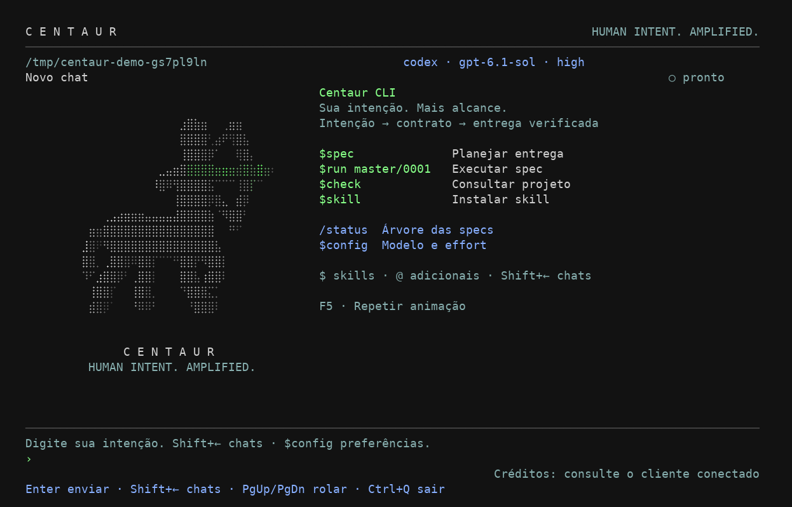
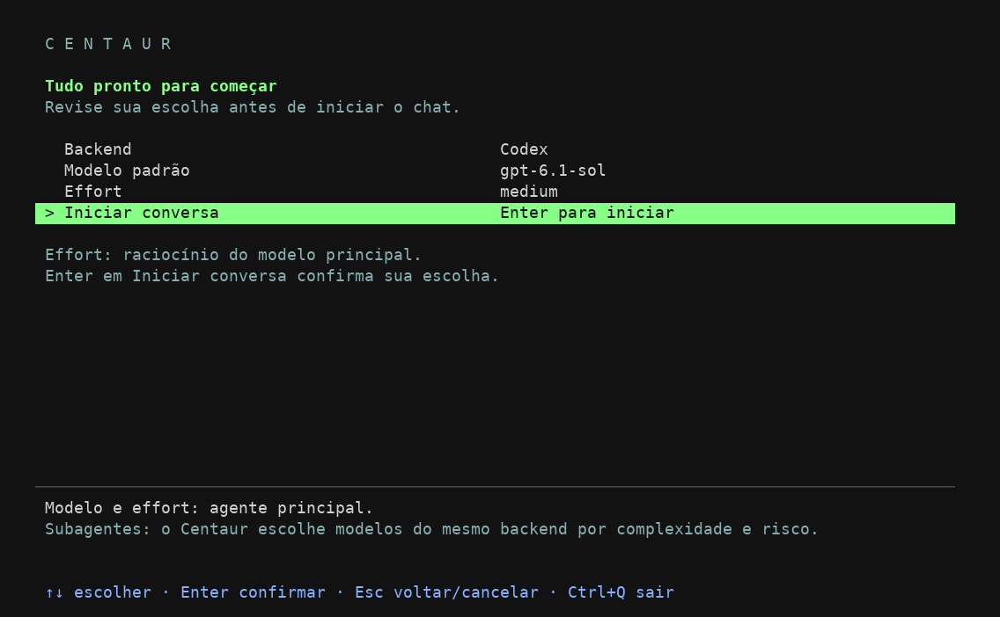

# Centaur

Harness de skills para guiar Codex e Claude Code pelos projetos, com uso principal no terminal. A IA coordena o trabalho; o humano define comportamentos e limites. Specs organizam entregas, contratos definem o aceite e evidências permitem conferir o resultado.

## CLI com OpenRouter, Codex e Claude

O projeto inclui um executável próprio com interface de terminal,
histórico por pasta e ferramentas de programação. Requer Python 3.10+ e terminal com curses
(Linux/macOS). A implementação usa a biblioteca padrão, sem dependências de execução.
O visual usa o emblema Convergência: duas faixas curvas finas que se encontram, com versão
animada Braille e fallback em blocos/ASCII. Fundo escuro, comandos em verde e atalhos em azul. Adapta-se ao tamanho do terminal e respeita `NO_COLOR`.
Veja as decisões em [DESIGN.md](DESIGN.md) e os comportamentos em [UX-CONTRACT.md](UX-CONTRACT.md).



*Captura de uma sessão de demonstração local, com cliente simulado.*

### Instalação da versão publicada

A versão atual é `0.3.0`. O workflow publica wheel, código-fonte e checksums na
[release `cli-v0.3.0`](https://github.com/Dalistor/Centaur-Driven/releases/tag/cli-v0.3.0).
Com essa release disponível, instale o comando globalmente para seu usuário usando pipx:

```bash
pipx install https://github.com/Dalistor/Centaur-Driven/releases/download/cli-v0.3.0/centaur_cli-0.3.0-py3-none-any.whl
centaur --version
centaur /caminho/do/projeto
```

O mesmo wheel pode ser instalado com `python3 -m pip install URL_DO_WHEEL` em um ambiente
Python que permita instalação. Se seu sistema gerencia o Python, use pipx ou um virtualenv.
Depois da configuração inicial do PyPI e da publicação bem-sucedida, também será possível
usar `pipx install centaur-cli` ou `python3 -m pip install centaur-cli`.
Veja [publicação e novas versões](docs/publishing.md) e o [changelog](CHANGELOG.md).

### Instalação diretamente pelo GitHub

Com Git e pipx instalados, instale a versão da branch `main`:

```bash
pipx install 'git+https://github.com/Dalistor/Centaur-Driven.git@main'
centaur .
```

Para atualizar essa instalação:

```bash
pipx upgrade centaur-cli
```

Se o comando `centaur` não aparecer, execute `pipx ensurepath` e reabra o terminal.

### Antes de iniciar a conversa

Ao executar `centaur .`, escolha **Backend → Modelo padrão → Effort → Iniciar conversa**.
OpenRouter usa uma chave de API; Codex e Claude usam o login dos seus CLIs locais.
As preferências da pasta ficam pré-selecionadas. ↑/↓ navegam, Enter confirma e Esc volta
ou cancela; é possível revisar qualquer campo antes de abrir o chat.



*Captura de terminal real em uma demonstração com autenticação e catálogo simulados.*

O modelo e o effort escolhidos definem o **agente principal**. Durante `$run`, o Centaur
pode escolher outros modelos do mesmo backend para cada subagente, conforme a complexidade
e o risco da task. Essa explicação permanece visível nas etapas da seleção inicial.

A conexão é validada depois da confirmação. Se falhar, as escolhas são preservadas para
corrigir ou trocar o backend. Só após a validação as preferências são salvas em
`.centaur/config.json` e o chat é aberto. Cancelar a seleção não autentica nem cria um chat.
O catálogo público do OpenRouter pode ser consultado sem chave; escolher um modelo não
faz uma chamada de geração. O cadastro de chave continua usando entrada oculta.

Flags e variáveis de ambiente definem as escolhas iniciais e podem ser alteradas no seletor.
Para abrir diretamente com elas ou com as preferências salvas, use `centaur . --no-setup`.
`centaur status`, `--configure-key` e `--configure-credits-key` continuam com seus fluxos próprios.

### Desenvolvimento local

```bash
python3 -m venv .venv
source .venv/bin/activate
python3 -m pip install -e .
# Opcional: ID de um modelo com suporte a ferramentas.
export OPENROUTER_MODEL='provedor/modelo'
centaur /caminho/do/projeto
# Sem instalar, na raiz deste repositório:
python3 -m centaur_cli /caminho/do/projeto
```

Para conectar os CLIs locais, faça login neles e escolha o backend:

```bash
codex login
centaur --backend codex /caminho/do/projeto

claude auth login
centaur --backend claude /caminho/do/projeto
```

`--backend` aceita `openrouter` (padrão), `codex` ou `claude`; `CENTAUR_BACKEND` define o padrão. Codex/Claude reutilizam sua própria autenticação, sem solicitar chave OpenRouter. Precisam estar no `PATH`, com versões que suportem as opções de isolamento e resposta estruturada usadas pelo adaptador. Versões incompatíveis são recusadas, sem fallback para outro provedor.

Com **Codex ou Claude conectado**, `$run` cria subagentes no mesmo backend e escolhe o modelo por task conforme complexidade e risco. `delegate_task` aceita título, task e um modelo do catálogo; `cost_tier` é exclusivo do OpenRouter. `--model` pré-seleciona o modelo principal; a opção Padrão do provedor usa o padrão do CLI nativo. `CENTAUR_MODEL` define esse modelo; `OPENROUTER_MODEL` só afeta OpenRouter. `$config` abre o seletor; `$config <backend> [modelo] [effort]` altera a fonte da IA e o modelo principal, salvando a preferência local e abrindo novo chat. Chats gravam o backend e só são retomados com backend compatível; chats nativos também exigem o mesmo modelo principal solicitado.

A interface, o autocomplete, `/status` e as aprovações continuam no Centaur. O adaptador usa saídas estruturadas dos CLIs, sem ferramentas nativas de execução/delegação e sem carregar as personalizações locais desses clientes; leituras, gravações e comandos passam pelas ferramentas do harness. Cada etapa envia o contexto Centaur a uma execução efêmera do CLI, com limite de 180 segundos; os históricos ficam no Centaur. O adaptador não interpreta o ID efetivo de modelo quando o CLI não o fornece. As credenciais conhecidas dos backends são ocultadas nas mensagens e saídas e removidas do ambiente dos comandos de projeto.

Também aceita `centaur status --ai --backend codex` ou `--backend claude`. A integração nativa não consulta créditos OpenRouter nem estima saldo de assinatura; o canto do terminal orienta consultar o cliente conectado. Usar esses backends segue a autenticação e os limites do respectivo cliente.

Referências: [execução estruturada do Codex](https://developers.openai.com/codex/noninteractive), [Claude programático](https://code.claude.com/docs/en/headless) e [opções de isolamento do Claude](https://code.claude.com/docs/en/cli-reference).

A opção Padrão do provedor usa o modelo padrão da conta OpenRouter.
A API e as chamadas de ferramentas seguem a [documentação do OpenRouter](https://openrouter.ai/docs/guides/features/tool-calling).
O modelo precisa aceitar ferramentas. Ao confirmar OpenRouter sem uma chave cadastrada,
o CLI inicia o cadastro local antes de abrir o chat: orienta a criar a chave na [página de chaves do OpenRouter](https://openrouter.ai/settings/keys),
oferece abrir o navegador e recebe a chave em um campo sem eco. A validação usa somente
`GET /api/v1/key`, sem chamar um modelo ou consumir tokens. Chaves recusadas podem ser
digitadas novamente; entrada vazia ou Ctrl+C cancela. Se o terminal não oferecer entrada
oculta, o cadastro é interrompido.

A chave é salva em `~/.config/centaur/credentials.json` (ou sob `XDG_CONFIG_HOME` absoluto),
fora do histórico do projeto, com pasta `0700` e arquivo `0600`. É um arquivo local protegido
por permissões, sem criptografia. As próximas aberturas reutilizam a credencial. Para trocar:

```bash
centaur --configure-key
```

`OPENROUTER_API_KEY`, se já definida, tem prioridade e não é copiada para o arquivo.
A chave cadastrada não é exibida nem enviada no conteúdo dos chats. O CLI rejeita mensagens
que contenham essa chave e oculta seu valor nas saídas de ferramentas e respostas. Comandos
filhos não recebem `OPENROUTER_API_KEY`; as ferramentas de arquivo bloqueiam o arquivo de credenciais.
Mensagens e arquivos consultados pelo modelo são enviados ao OpenRouter.

O canto inferior direito exibe créditos com barra e valor em US$. A consulta roda em segundo
plano ao abrir, a cada 30 segundos e após cada turno. `/credits` solicita uma atualização.
Sem conexão, mantém o último valor com `~` para indicar que está desatualizado; sem leitura
anterior mostra “indisponível”, sem inventar saldo.

Para ver o **saldo total da conta**, cadastre uma chave separada:

```bash
centaur --configure-credits-key
```

O cadastro orienta a criar uma [Management API Key](https://openrouter.ai/settings/management-keys),
recebe-a em entrada oculta e valida com `GET /api/v1/credits`. Essa chave tem poderes
administrativos; o CLI a utiliza somente para consultar créditos, separada da chave de chat.
Também aceita `OPENROUTER_CREDITS_KEY`; ambas as chaves ficam protegidas contra inclusão no
chat e no ambiente dos comandos filhos. O endpoint de [saldo da conta exige chave de
gerenciamento](https://openrouter.ai/docs/api/api-reference/credits/get-remaining-credits).
Sem ela, mostra **Chave**, com seu limite restante consultado em `GET /api/v1/key`;
“sem limite” significa que a chave não tem teto, sem informar o saldo da conta.

### Conversa e progresso


*Captura do terminal real em uma sessão de demonstração com cliente simulado.*

O chat usa uma coluna de leitura de até 100 células, com mensagens do usuário destacadas,
título em negrito no topo e resposta final separada do trabalho em andamento. O modelo
pode comunicar próximos passos e descobertas em resumos públicos antes das ferramentas;
as ações mostram estado pendente, conclusão, falha ou recusa a partir de seus resultados.
`Ctrl+O` abre as saídas completas; o histórico continua armazenando os resultados originais.
Esse resumo não exibe raciocínio interno do provedor. Markdown básico fica legível e
blocos de código preservam seu conteúdo literal.

Depois da primeira resposta bem-sucedida, uma chamada adicional ao mesmo backend gera
um título curto em segundo plano. Essa chamada segue os custos e limites do backend.
A conversa fica disponível enquanto o nome é gerado. Falha mantém o título provisório;
renomear manualmente sempre tem prioridade, inclusive quando a geração termina atrasada.
`/status` local não faz essa chamada. Credenciais e raciocínio privado não entram no pedido
de título; a geração recebe apenas trechos da primeira troca da conversa, sem ferramentas.

Ao redimensionar a janela, cabeçalho, histórico, lista de chats, entrada e barra de créditos
são reposicionados e o texto é quebrado novamente. O rascunho e a conversa são preservados.

| Controle | Ação |
| --- | --- |
| `Shift+←` ou `/chats` | Abrir os chats salvos da pasta, inclusive durante uma resposta. `←` e `→` editam a mensagem. |
| `↑` / `↓` e Enter | Selecionar e retomar um chat quando o turno atual terminar. |
| Delete | Excluir o chat selecionado na lista e seu histórico salvo. Chats em execução aguardam o fim do turno. |
| Esc ou `→` | Voltar da lista para a conversa. |
| `$` | Autocomplete das skills Centaur; digite para filtrar. |
| `@` | Autocomplete de skills adicionais em `.centaur/skills/`. |
| ↑ / ↓, Tab ou Enter na lista de skills | Escolher e inserir a skill; Esc fecha a lista. Enter após inserir envia a mensagem. |
| `$config` | Abrir o seletor de backend, modelo e effort. ↑/↓ escolhem, Enter abre/confirma, Esc volta/cancela. Salvar abre novo chat e preserva os anteriores. |
| R ou F2 na lista de chats | Renomear a conversa selecionada; Enter salva e Esc cancela. |
| `/rename` ou `/rename Novo título` | Renomear a conversa atual sem chamar o modelo. |
| `Ctrl+O` | Alternar resumo e detalhes das ferramentas na conversa. |
| `/new` | Criar outra conversa. |
| `/status` | Mostrar a árvore local das specs, sem chamar o modelo. |
| `/status --ai` | Analisar evidências e recomendar o que pode concluir ou rodar, somente leitura. |
| `/credits` | Atualizar o indicador de créditos sem enviar mensagem ao modelo. |
| PgUp / PgDn | Rolar o histórico ou revisar uma ação pendente. |
| `y` / `n` | Permitir ou recusar a gravação/comando exibido. |
| `←` / `→`, Home / End, Delete | Mover o cursor e editar a mensagem. |
| Ctrl+U | Limpar a mensagem ou o filtro digitado. |
| `/quit` ou Ctrl+Q | Sair após concluir o turno. |

### Preferências e esforço de raciocínio

Use `$config` para escolher **Backend → Modelo → Effort → Salvar e abrir novo chat**.


*Os níveis disponíveis variam conforme o catálogo do modelo.*
Os campos pertencem à configuração da próxima conversa; nada é aplicado ao navegar ou
cancelar. A validação de instalação/autenticação roda em segundo plano, sem chamar um
modelo. Se falhar, o seletor conserva as escolhas e mostra como tentar novamente.

No seletor de modelos, digite para filtrar localmente; Ctrl+U limpa. **Modelo personalizado**
aceita um ID/alias e **Padrão do provedor** deixa o modelo sem override. OpenRouter consulta
`GET /api/v1/models` e mostra modelos que aceitam ferramentas, além do Auto Router. Codex
usa o cache local `~/.codex/models_cache.json` (ou `CODEX_HOME`); Claude usa `haiku`, `sonnet`
e `opus`. Se o catálogo não estiver disponível, ainda é possível informar um modelo.

**Effort** controla o raciocínio do modelo principal. `default` deixa a escolha com o provedor.
Referência: [controle de raciocínio OpenRouter](https://openrouter.ai/docs/guides/best-practices/reasoning-tokens)
e [opções do Claude CLI](https://code.claude.com/docs/en/cli-reference).
OpenRouter envia `reasoning.effort`, Codex envia `model_reasoning_effort` e Claude envia
`--effort`. O seletor restringe os níveis aos metadados do modelo quando disponíveis no
catálogo OpenRouter ou no cache Codex. Sem esses metadados, a confirmação final de suporte
cabe ao provedor/CLI; uma escolha incompatível retorna erro, sem fallback silencioso.
O nível `ultra` do cache Codex não é exposto porque ativa delegação nativa, fora da coordenação
Centaur. Subagentes continuam com o esforço padrão de seu próprio modelo; o limite
`--max-subagent-tier` controla a faixa de custo do roteamento, separadamente.

Também são aceitos comandos diretos e opções iniciais:

```bash
# Dentro do chat:
$config codex gpt-6.1-sol high
$config claude sonnet medium
$config openrouter openrouter/auto

# Pré-selecionar as opções iniciais:
centaur . --backend codex --model gpt-6.1-sol --effort high
# Abrir diretamente, sem o seletor inicial:
centaur . --no-setup --backend codex --model gpt-6.1-sol --effort high
```

Preferências ficam em `.centaur/config.json`, sem credenciais. Arquivos antigos com apenas
`backend` e `model` continuam válidos. Para backend/modelo/effort, flags têm prioridade sobre
variáveis de ambiente (`CENTAUR_BACKEND`, `CENTAUR_MODEL` / `OPENROUTER_MODEL`,
`CENTAUR_EFFORT`), que têm prioridade sobre preferências locais. Ao mudar o backend, modelo
e effort salvos de outro backend não são reaproveitados. Cada chat novo registra o effort;
retomar um chat preserva seu modelo e seu effort original. Chats antigos usam `default`.

O terminal desenha o emblema **Convergência** com um renderizador gráfico próprio: duas
faixas curvas finas, prateada e verde, que se encontram em uma ponta comum, e uma flecha
verde fina que atravessa o centro e avança além da junção. O símbolo
representa julgamento humano e execução por IA seguindo uma intenção compartilhada.
A geometria vetorial em relevo tem perspectiva, profundidade, iluminação e rasterização
Braille Unicode (8 pontos por célula). A sequência dura 6 segundos, com cadência alvo de 20 FPS, e termina em uma pose frontal estável.
F5 repete na abertura sem rascunho; digitar encerra o movimento. Seletores e histórico
pausam o relógio; redimensionar preserva a fase. O renderizador usa apenas a biblioteca
padrão do Python, com malha em cache e palco limitado para manter o custo previsível.


O CLI também mostra indicador de atividade, tempo decorrido, nome da conversa e estado de trabalho.
As mensagens separam autor e conteúdo; seletores compartilham cores e seleção com o histórico.
A animação indica atividade, não porcentagem de conclusão. Para reduzir movimento:

```bash
CENTAUR_REDUCED_MOTION=1 centaur .
NO_COLOR=1 centaur .
# Usar o emblema estático em blocos/ASCII (por exemplo, fonte sem Braille):
CENTAUR_GRAPHICS=0 centaur .
```

`CENTAUR_REDUCED_MOTION=1` usa a pose final sem giro. `NO_COLOR` remove cores, mantendo
seleção por inversão e níveis de brilho por atributos. Terminais sem codificação Braille
recebem o desenho estático Unicode/ASCII; cores usam ANSI 256 ou o fallback disponível. O CLI preserva rascunho e posição do
cursor ao redimensionar. Em terminais que interceptem Shift+←, use `/chats`.

Os chats ficam em `.centaur/chats/*.json` na pasta aberta, com gravação atômica e permissão
de arquivo restrita ao usuário. Cada execução começa com uma conversa nova; use `Shift+←` para
retomar as anteriores, preservando o modelo utilizado. Arquivos de histórico inválidos são
ignorados. Inclua `.centaur/chats/` no `.gitignore` dos projetos para evitar publicar conversas.

O agente pode listar e ler arquivos UTF-8 dentro da pasta aberta. Gravações mostram o caminho
e o conteúdo para aprovação; comandos mostram o shell que será executado. Use PgDown para
revisar conteúdo longo antes de confirmar. **Comandos aprovados executam com as permissões
do usuário; a pasta de trabalho não constitui uma sandbox.** O agente recebe o `AGENTS.md`
da raiz e pode consultar skills existentes no projeto pelas ferramentas de leitura.

`$run` delega as tasks para subagentes com contexto próprio. No backend OpenRouter, por padrão eles usam o
[Auto Router do OpenRouter](https://openrouter.ai/docs/guides/routing/routers/auto-router),
que escolhe o modelo a partir da task e do suporte a ferramentas. O coordenador define
`cost_tier` por risco/complexidade e confere o trabalho antes de consolidar. O CLI registra
os modelos efetivos por resposta; cada subagente mantém sua própria `session_id`.
Codex/Claude mantêm o backend e permitem selecionar o modelo por task. O coordenador usa o catálogo local do Codex ou os aliases `haiku`, `sonnet` e `opus` do Claude; acesso depende da conta. Sem catálogo, o Codex usa o modelo principal. `cost_tier` continua exclusivo do OpenRouter. As aprovações de arquivos/comandos mostram o executor. Históricos individuais ficam em
`.centaur/agents/<chat-coordenador>/`, sem aparecer como chats independentes na lista.

```bash
# Restringir subagentes às faixas low/medium:
centaur --max-subagent-tier medium /caminho/do/projeto
```

O máximo padrão é `high`; opções: `low`, `medium`, `high`, `xhigh`, `max`.
Faixas de roteamento não garantem um teto monetário; os preços e limites da conta seguem
o OpenRouter. Modelo específico só deve ser solicitado quando a task ou o usuário o exigir.
`clean-code` e suas referências podem ser lidos pelo CLI a partir da instalação completa
em `.centaur/skills/clean-code/` no projeto ou nos diretórios de skills do usuário.
O autocomplete `@` lista somente skills adicionais da pasta `.centaur/skills/` do projeto.

Limites desta versão: respostas completas, sem streaming; uma execução ativa por conversa;
até 20 etapas por turno; timeout de 60 segundos por requisição/comando; sem compactação
automática do contexto, MCP ou importação de chats de outros clientes. Subagentes executam
sequencialmente, até 12 por turno, sem delegação recursiva. Use uma única instância
por conversa para evitar sobrescrever histórico. Ferramentas de leitura retornam até 24 mil
caracteres; chamadas interrompidas são marcadas na retomada, sem repetir ações automaticamente.
O CLI inclui as skills no pacote em `centaur_cli/skills/` e as consulta com `read_skill`,
sem copiá-las para cada projeto. Os comandos `$spec`, `$run`, `$check` e os demais nomes
do catálogo instruem o agente a ler e seguir a skill correspondente. As referências e
scripts também acompanham o pacote. A instalação em outros clientes continua descrita abaixo.

### Validar integração e conclusão

O ciclo mantém contrato aprovado, implementação, evidência e entrega como dimensões
separadas. `$spec` planeja dentro do contrato; `$run` executa e verifica; `$check` e `/status`
consultam o estado. `/status --ai` tem somente ferramentas de leitura e recebe também as
pendências de conclusão calculadas localmente.

```bash
# Integridade dos registros (não significa que o projeto está concluído):
python3 centaur_cli/skills/graphify/scripts/validate-lifecycle.py /projeto

# Regra pronta para integrar, com dependências entregues e prova corrente:
python3 centaur_cli/skills/graphify/scripts/validate-lifecycle.py /projeto --ready reservas/RES-01

# Spec pronta para concluir, inclusive filhas e dependências:
python3 centaur_cli/skills/graphify/scripts/validate-lifecycle.py /projeto --complete master/0001
```

`--complete` exige checklist completo, `**Contrato:** id@versão` vigente/aprovado,
`**Regras:** RES-01, RES-02` (ou IDs qualificados), implementação, evidências correntes e
entrega integrada/publicada de cada regra. Percorre filhas e dependências por IDs
qualificados, detectando ausência, ciclos e vínculos divergentes. O status `Concluída`
no README sozinho não satisfaz o gate; uma regra apenas local também não conclui a spec.
Specs legadas sem vínculos são preservadas e precisam de rastreabilidade antes dessa nova
afirmação. O comando é somente leitura e sai com código 1 em falha. Ele confere registros e
hashes locais; a revisão, integração remota e publicação precisam ser observadas pelas
ferramentas reais. Não se faz deploy automaticamente ao concluir.


## Autocomplete e skills adicionais

Digite `$` no início da mensagem ou de um novo termo para abrir a lista das skills Centaur. Continue digitando para filtrar por nome. `@` abre a lista de skills adicionais instaladas no projeto. Use ↑/↓ para selecionar, Tab ou Enter para inserir e Esc para fechar; a seleção não envia a mensagem. A lista acompanha o redimensionamento do terminal.

Skills adicionais e todos os seus arquivos de apoio ficam em `.centaur/skills/<nome>/`, com um `SKILL.md` na raiz da skill:

```text
.centaur/skills/
└── minha-skill/
    ├── SKILL.md
    ├── references/
    └── scripts/
```

O nome sugerido é o nome da pasta. Pastas incompletas ou internas não aparecem. `$run` usa a skill Centaur; `@run` usa `.centaur/skills/run/SKILL.md`, sem substituir a skill integrada. O agente lê skills adicionais com `read_skill` usando `@nome/SKILL.md` e `@nome/references/arquivo.md`. A leitura permanece dentro da skill selecionada; links que saem da pasta de skills do projeto não são aceitos.

```text
$run master/0001
@minha-skill Revise este módulo
```

Use a skill Centaur `$skill` para instalar uma skill adicional:

```text
$skill Instale https://github.com/dono/repo/tree/main/skills/minha-skill
$skill Instale a skill clean-code de btseee/clean-code-skills, pasta skills/clean-code
```

A instalação usa o [helper incluído](centaur_cli/skills/skill/scripts/install.py), preserva os arquivos da pasta e recusa um destino existente. O download aceita repositórios públicos GitHub, com referência ou commit selecionado. Scripts baixados não são executados. A skill instalada aparece como `@nome` sem reiniciar o CLI. Veja o [fluxo da skill](centaur_cli/skills/skill/SKILL.md).

Os diretórios de skills do Codex e Claude Code continuam sendo usados pela instalação nesses clientes. Para disponibilizar uma skill adicional no Centaur CLI, instale sua pasta completa em `.centaur/skills/`.

## Status das specs

No chat, use `/status` para ver as specs master e suas filhas em árvore, inclusive quando as filhas pertencem a outros módulos. Specs independentes ficam agrupadas pelo escopo. A lista mostra o que falta implementar, o que está em revisão, o que foi registrado como concluído, bloqueios, cancelamentos, dependências e tasks ainda desmarcadas.

Também funciona fora do chat, sem chave ou terminal interativo:

```bash
centaur status /caminho/do/projeto
# Análise opcional com a chave e o modelo configurados:
centaur status /caminho/do/projeto --ai
```

Os caminhos vêm de `.centaur/workspace.json`; sem esse arquivo, consulta `.centaur/specs` ou o legado `specs`. Os vínculos usam `Spec mestre` e `Specs filhas` com IDs qualificados, como `master/0001` e `api/0002`. Referências ausentes, divergentes ou circulares aparecem como avisos, sem esconder specs.

`/status --ai` (ou `centaur status --ai`) usa o backend conectado para analisar o que **pode ser marcado como concluído** e o que **pode rodar**, citando fontes, gates e bloqueios. A análise dispõe apenas de leitura e da projeção canônica `lifecycle_status`, que confere contratos, dependências e hashes de evidências; não executa testes novos, não edita specs e não inicia tasks. A conclusão da mestre exige comprovação das filhas e dos critérios de integração. Dados insuficientes aparecem como verificação pendente. A análise é salva no histórico da pasta e usa os limites/créditos do backend; o status local não chama o modelo.

O status local mostra o estado registrado, não certifica conclusão. Recomendações da IA são separadas desses registros; alterações e execução seguem os fluxos de coordenação das skills.

## Uso no terminal

Peça o trabalho em linguagem natural ou invoque a skill. O Centaur apresenta um resumo do resultado, validação, bloqueios e próximo passo; detalhes ficam nos arquivos vinculados em `.centaur/`.

```text
$spec Planeje a busca e a exportação como entregas independentes
$run master/0001
$check Qual o estado das specs e o próximo passo?
```

Essas são instruções para as skills dentro da sessão de IA, aceitas no chat do CLI e em clientes
com as skills instaladas; não são comandos executáveis do shell. Também é possível pedir:
“Retome a spec 0001 e use agentes nas tasks independentes”. A disponibilidade de agentes
depende do cliente; um único agente pode executar as tasks sequencialmente. O run executa
uma spec por chamada.

Várias specs podem coexistir no mesmo projeto e no mesmo escopo. Cada uma mantém objetivo, aceite, responsável, arquivos previstos, dependências e estado próprios. Use spec mestre/filhas somente quando houver uma entrega conjunta a integrar. O coordenador reserva cada spec antes de executar, compara interferências entre tasks e consolida alterações compartilhadas serialmente. Em terminais separados, uma spec reservada por outra sessão aguarda; tarefas independentes continuam. Veja [concorrência e retomada](centaur_cli/skills/graphify/references/team-workspace.md).

Uma consulta de andamento pode ser tão curta quanto:

```text
Spec         Estado          Próximo passo
master/0001  Em andamento    Validar busca
master/0002  Bloqueada       Aguarda master/0001 — Task 02 integrada
```

Os estados refletem os registros reais. Teste aprovado não equivale a integração, e checklist não comprova comportamento. O fluxo pelo terminal usa diretamente specs, fontes e evidências.

## Instalação e atualização neste PC

Requer Python 3.10+, Git e a skill completa [clean-code](https://github.com/btseee/clean-code-skills), incluindo suas referências. Skills são instaladas no Codex em `~/.agents/skills/` e no Claude Code em `~/.claude/skills/`.

```bash
git clone https://github.com/Dalistor/Centaur-Driven.git
cd Centaur-Driven
mkdir -p ~/.agents/skills ~/.claude/skills
# Inspecionar a substituição antes de aplicar:
python3 scripts/install.py --root . --target ~/.agents/skills --target ~/.claude/skills
python3 scripts/install.py --root . --target ~/.agents/skills --target ~/.claude/skills --apply
```

O instalador publica os nomes curtos, remove as versões antigas com prefixo `centaur-driven-`
e as antigas `memory`, `centaur-driven-memory` e `centaur-driven-commitAndPush`, com backup em `.centaur/backups/` e rollback em
caso de falha. Os recursos internos são publicados em `_internal/`, ao lado das skills. Outros nomes são preservados. Se já existir uma skill com o mesmo nome curto,
ela será substituída; revise o dry-run antes de aplicar. Reinicie as sessões dos agentes
para carregar as instruções novas.

Neste repositório de distribuição, `.centaur/` guarda somente o contexto local e fica fora do versionamento. Nos projetos que usam as skills, siga a política de versionamento das definições, specs e evidências descrita abaixo.

Instale `clean-code` completo no mesmo diretório de skills, caso ausente; não copie apenas `SKILL.md`. Referência da integração: 3.2.0. Não é necessário instalar Graphify nem ai-memory para usar busca direta e registros em arquivos.

## Skills

| Skill | Finalidade |
| --- | --- |
| `skill` | Baixar e instalar skills adicionais completas em `.centaur/skills/`. |
| `start-project` | Inicializar instruções, escopos e conceito do projeto. |
| `spec` | Definir contratos e planejar entregas verificáveis. |
| `run` | Executar entregas, consolidar evidências e integrar conforme autorização. |
| `implement` | Mudanças diretas de estrutura, configuração e UI, com validação proporcional. |
| `tdd` | Regras de negócio e correções relevantes guiadas por testes. |
| `check` | Responder com base nas fontes atuais, sem alterar arquivos. |
| `security` | Auditar segurança e relatar evidências, sem corrigir automaticamente. |
| `mcp` | Consultar APIs externas e encaminhar o trabalho à skill apropriada. |
| `graphify` | Investigar relações e manter índices/mapas sob demanda. |
| `update` | Migrar/reconstruir estrutura gerada e verificar dependências, preservando definições. |
| `deploy` | Preparar GitHub Actions e acessos, com instruções para publicação. |

`memory` fica em `skills/_internal/memory/`, com seu contrato e instruções de integração com ai-memory. Outras skills a chamam para consultar e registrar contexto; ela não aparece como comando no catálogo do CLI. O serviço ai-memory continua sendo uma dependência externa opcional.

Memória responde por decisões e resultados históricos; Graphify ajuda a localizar relações no código. Comece com busca direta. Quando motivo e impacto forem necessários, recupere o histórico pela subskill, investigue relações com Graphify se necessário e confirme nas fontes atuais. Consulta e registro de memória não atualizam o grafo. Veja o [fluxo compartilhado de contexto](centaur_cli/skills/graphify/references/context.md#memória-e-relações-do-código).

## Conceito, requisitos e realização

A [base conceitual](centaur_cli/skills/graphify/references/specification.md) integra ao contrato:

- Conceito, objetivos, escopo e exclusões.
- Requisitos funcionais e não funcionais, com critérios verificáveis.
- Casos de uso com atores, pré-condições, fluxos, alternativas e falhas.
- Entidades, atributos, relacionamentos, cardinalidades e regras de integridade.

Os requisitos usam `rules`, com `kind: functional | non_functional`; atores, casos de uso e dados usam o campo opcional `specification`. Contratos antigos continuam válidos. Casos de uso referenciam regras existentes e relacionamentos referenciam entidades declaradas; o validador recusa referências inválidas.

Contratos aprovados são versionados, sem reescrita silenciosa. O estado liga regras a arquivos e testes; evidências registram método, resultado e hashes. Alterações em fontes ou definições tornam evidências anteriores desatualizadas. Implementação, verificação e publicação são estados distintos. Veja [ciclo e formatos](centaur_cli/skills/graphify/references/lifecycle.md).

Comece por uma funcionalidade de ponta a ponta. O planejamento da entrega fica nas specs; definições não precisam ser repetidas em vários documentos. Fluxogramas editáveis são rascunhos até serem incorporados ao contrato aprovado.

## Arquivos do projeto

```text
projeto/
├── AGENTS.md                     # Entrada mínima de instruções para agentes
├── .github/workflows/            # Workflows no caminho exigido pelo GitHub
└── .centaur/
    ├── workspace.json           # Escopos, responsáveis e backend de memória
    ├── contracts/<id>/vNNN.json  # Conceito e requisitos versionados
    ├── state/                   # Realização atual por regra
    ├── evidence/                # Verificações imutáveis
    ├── specs/                   # Planos de entrega
    ├── system/                  # Documentação gerada, fluxos e decisões
    ├── use-cases/               # Rascunhos visuais
    ├── graphify/                # Índice e caches opcionais
    ├── ai-memory/               # Configuração e arquivos locais de memória
    ├── implements/              # Registros no backend files ou histórico legado
    ├── deploy/                  # Scripts e artefatos auxiliares de deploy
    ├── worktrees/               # Execuções isoladas de agentes
    ├── backups/                 # Recuperação de migrações/instalações
    └── tmp/                     # Preparação temporária
```

Todos os artefatos gerados do Centaur ficam sob `.centaur/`. Exceções de integração mantêm o caminho exigido pelo consumidor: `AGENTS.md`, `.github/workflows/` e configuração do editor. Código do produto, instalação global de ferramentas e documentos independentes do usuário não são movidos para essa pasta.

Versione definições, estado e evidências. Ignore caches, temporários, backups, worktrees, artefatos de build e segredos. Um store ai-memory compartilhado continua sob administração do serviço; apenas os arquivos locais do projeto são centralizados.

## Contexto e memória

Busca textual e símbolos do editor são a primeira opção. Graphify é opcional para relações amplas; não há indexação automática após cada edição, commit ou entrega. Confirme resultados no código atual.

Para usar Graphify, instale `graphifyy` (`uv tool install graphifyy`) e registre a skill oficial com `graphify install --platform agents` ou `--platform claude`. Referência verificada: 0.9.65. O adaptador define `GRAPHIFY_OUT` para `.centaur/graphify/`:

```bash
python3 /caminho/centaur_cli/skills/graphify/scripts/graphify-local.py /projeto query "dependências do módulo" --budget 1500
# Extração apenas de código, explicitamente solicitada:
python3 /caminho/centaur_cli/skills/graphify/scripts/graphify-local.py /projeto extract --code-only
```

Extração AST não cobre documentação; para corpus misto, siga a skill Graphify com caminhos adaptados. Consulte [contexto e limites](centaur_cli/skills/graphify/references/context.md).

Ai-memory é opcional. A [subskill interna de memória](centaur_cli/skills/_internal/memory/SKILL.md) verifica serviço e cliente antes de ativar `memory.backend: ai-memory`. A identidade reside em `.centaur/ai-memory/config.toml`, com `workspace` e `project` explícitos em cada chamada. Não dependa da descoberta automática do marcador antigo na raiz. Falhas preservam registros em `.centaur/ai-memory/pending/`. Sem backend configurado, use `files`; nenhum projeto muda silenciosamente de backend. Consulte [contrato de memória](centaur_cli/skills/_internal/memory/references/contract.md).

## Update seguro

`/update` inventaria, verifica dependências, prepara a nova estrutura, valida e substitui somente após os checks. Preserva contratos, requisitos, evidências, decisões e configurações; falhas obrigatórias mantêm a instalação anterior.

O [migrador](centaur_cli/skills/update/scripts/migrate.py) move `graphify-out/`, configuração e fila antigas do ai-memory. Documentos gerados em `docs/system/` devem ser identificados com `--owned-doc`; arquivos vivos cujas referências precisam mudar usam `--reference`. Não sobrescreve conflitos nem move documentos manuais por suposição. Reexecução não duplica dados. Veja o [fluxo completo](centaur_cli/skills/update/SKILL.md).

```bash
python3 /caminho/centaur_cli/skills/update/scripts/migrate.py --root /projeto
# Após revisar o inventário, aplicar no escopo autorizado:
python3 /caminho/centaur_cli/skills/update/scripts/migrate.py --root /projeto --apply
```

As páginas de acompanhamento geradas antigas são removidas quando reconhecidas; HTML personalizado é preservado.

## Deploy

`/deploy` prepara o workflow e orienta os próximos passos, sem publicar nem executar o workflow. Pergunta entre push na `main` e execução manual; reutiliza SSH ou gera chave se faltar; fornece o comando de autorização da chave pública na VPS. Configura Environment, variables e secrets se houver acesso suficiente ao GitHub.

O workflow testa a integridade antes da publicação, transfere uma release isolada com retry limitado e só troca tráfego após health checks. Preserva dados e versão anterior para rollback. O template estático usa troca atômica; serviços dinâmicos precisam de estratégia específica, como blue-green. Infraestrutura e migrações incompatíveis com zero downtime são pendências explícitas. Veja [deploy e pré-requisitos](centaur_cli/skills/deploy/SKILL.md).

## Verificação do conjunto

```bash
python3 -m unittest discover -s tests -v
```

VPS real depende do ambiente de uso. O conjunto não alega deploy remoto apenas por passar nos testes locais.
