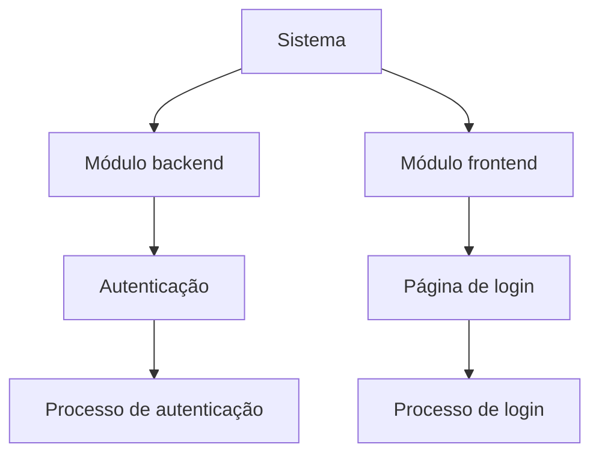
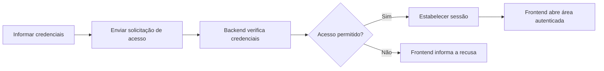

# Mapas legíveis do sistema

O mapa deve permitir entender o que cada área faz e como um processo acontece, sem conhecer nomes de classes, arquivos ou funções. Construa essa leitura consultando Graphify, documentação e código. Agrupe vários elementos técnicos em um único conceito funcional quando participarem da mesma responsabilidade.

## Hierarquia e navegação

Use os módulos reais do projeto no primeiro nível. Dentro de cada módulo, mostre funcionalidades, domínios ou páginas; depois os processos que eles oferecem. Detalhe as etapas em um fluxo separado, vinculado por link Markdown. Evite colocar todos os processos e etapas no mapa geral.

Exemplo ilustrativo; crie esses elementos somente se existirem no projeto ou estiverem explicitamente planejados:

As arestas desse mapa significam **contém/oferece**. Em um diagrama de processo, as setas significam sequência ou interação e devem ter rótulos quando necessário. Não confunda hierarquia com execução. Para conectar módulos, use um fluxo próprio mostrando, por exemplo, que o processo de login solicita autenticação ao backend.

Não presuma senha, sessão, token, provedor externo ou regras de recusa: adapte as etapas ao comportamento observado. Uma perspectiva de autenticação pode precisar mostrar SSO ou autenticação sem senha em vez deste exemplo.

## Regras de síntese

- Use nomes de negócio e ações familiares: `Página de login`, `Verificar acesso`, `Recuperar conta`. Reserve caminhos, endpoints e símbolos para Evidências, salvo se o usuário pedir uma perspectiva técnica.
- Comece pelo panorama. Se a leitura ficar densa ou exigir zoom para compreender o processo, divida por módulo/processo e conecte as notas por links. Cada perspectiva responde a uma pergunta explícita.
- Mostre entradas, decisões, saídas e falhas que mudam a experiência ou o resultado. Omita chamadas auxiliares, imports, getters e detalhes internos que não explicam o processo.
- Marque no texto dos nós o que é planejado ou inferido. Use o estado confirmado nas fontes; aparecer em uma spec não significa estar implementado. Histórico superado fica nas evidências, sem parecer comportamento atual.
- Registre na nota uma seção Evidências com correspondência entre conceitos/processos e fontes consultadas. Não invente relações para completar uma hierarquia simétrica entre módulos.
- Preserve nomes e links estáveis ao sincronizar. Atualize o mapa quando mudar uma capacidade, responsabilidade ou etapa observável, mesmo que a mudança envolva muitos arquivos.

## Verificação da entrega

Confira se uma pessoa consegue localizar módulo, funcionalidade/página e processo sem abrir código; se as setas têm significado consistente; se cada processo tem evidência ou marca de planejamento; e se o mapa principal aponta para o detalhe. Não entregue apenas o HTML técnico do Graphify como conclusão de um pedido de mapa legível.
