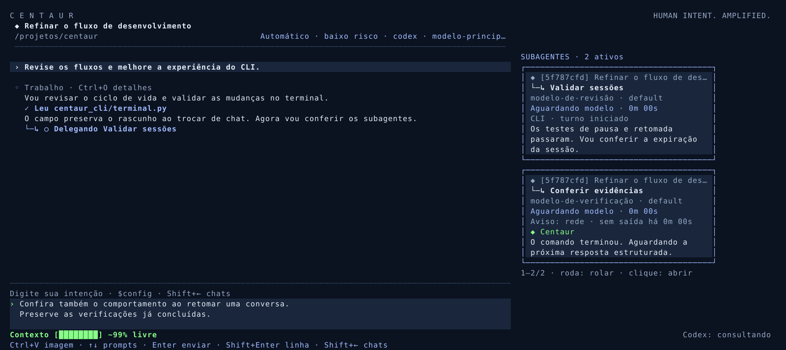
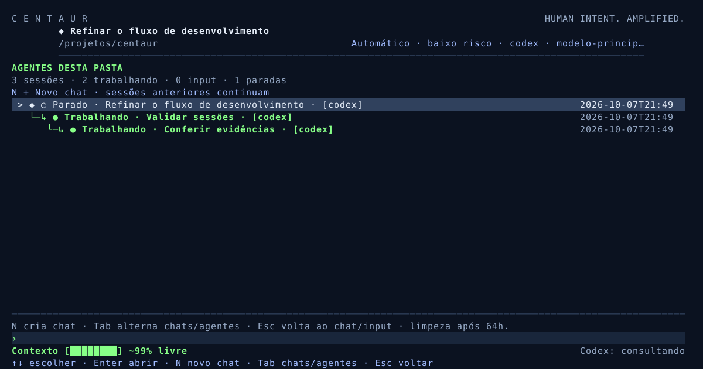

# Validação Centaur CLI 0.9.6

Data: 2026-10-07. As duas capturas mostram `✓ Executou sed ...` seguido por
`Aguardando modelo · 16m ...`. O comando terminou; a próxima inferência não havia
entregado resposta. A captura não confirma rede, travamento ou tempo de raciocínio.
A barra de 58% pertencia ao principal, inclusive no preview do executor: não podia
ser usada para inferir o espaço disponível no subagente.

A captura posterior mostra o coordenador recebendo timeout, lendo o histórico e
criando outra delegação. Os 2190s são a duração do turno principal; o cartão da nova
delegação mostra 8s. O relato de detecção após cerca de 2000s é compatível com o
limite de 1800s da inferência acrescido das etapas anteriores, sem provar a causa
da demora. O transcript marcava `✓ Delegou` mesmo quando o JSON retornava status
failed; agora distingue falha, cancelamento e relatório recebido. Receber relatório
não significa que o coordenador já validou a tarefa. A nova delegação observada foi
uma decisão do coordenador, não replay automático da ferramenta pelo harness.

## Correções e limites

- AgentTree mantém principal/ancestrais, ordem da árvore e conectores recursivos.
  Menu, cartões e preview usam o mesmo owner. Enter e clique em executor com input
  retornam ao principal local. Pais ausentes/ciclos/profundidade de 1100 níveis não
  causam recursão infinita; seleção é preservada por ID. Não habilita delegação extra.
- Apenas ancestrais pertinentes são carregados para cartões vivos; históricos parados
  não relacionados continuam sem desserialização periódica. Preview usa contexto próprio
  e exclui mensagens/rascunho do principal.
- Subagentes não herdavam effort/speed do chat. Agora preservam as escolhas quando
  compatíveis com o modelo: effort incompatível usa default e Fast não anunciado usa
  standard. Escolhas são persistidas e visíveis; backend/modelo não são trocados.
- wait() sem prazo após SIGKILL de comando era um caminho potencial de bloqueio.
  stop_command usa wait(timeout=2), trata a corrida ProcessLookupError e relata saída
  incerta. Isso não prova que essa limpeza foi o motivo da captura, cuja fase era modelo.
- NativeTrace.on_progress entrega somente enums públicos e contagens de bytes.
  SessionRegistry ignora campos extras, separa última saída/phase_started de heartbeat,
  e limpa dados ao mudar de fase. Metadados não expõem raciocínio, comandos ou segredos.
  Observador com falha não interrompe execução autorizada. Prazo absoluto continua
  1800s e silêncio continua permitido por padrão. Cancelamento continua propagando.
- BRIDGE_INSTRUCTIONS reforça que a inferência produz somente a próxima etapa do
  harness, sem resolver toda a task internamente ou simular chamadas não executadas.
  Trata-se de orientação de integração, não garantia de latência do modelo.

Fonte do protocolo: [Codex não interativo](https://developers.openai.com/codex/noninteractive/).
Saída estruturada por etapa difere da sessão interativa. Não há Codex autenticado neste
executor; os testes usam subprocessos Python reais, sem rede/conta/chamadas pagas.
Demora de modelo, reconexões, contexto do executor e limpeza de processos são situações
distintas; somente a nova telemetria da execução local pode confirmar a causa específica.

## Verificação

- 494 casos na suíte, 488 aprovados localmente e seis opt-in desktop/clipboard ignorados.
- Sete regressões de hierarquia: ordem de neto, pai/principal, clique com input,
  seleção/retorno, ciclos/pais ausentes/1100 níveis, conectores de lote e barra do executor.
- Oito regressões de espera/configuração: comando concluído seguido por inferência
  silenciosa cancelável, histórico com exatamente um resultado de ferramenta,
  stop_command sem wait ilimitado, corrida de saída, deadline, heartbeat sem progresso,
  observador sem dados privados e sem abortar sucesso, effort/Fast compatível/incompatível.
- PTY real: árvore/menu/preview/retorno/resize 40×12 em cores, NO_COLOR e movimento
  reduzido. O teste anterior mantém multiline/paste/compactação/retomada em quatro modos.
- Screen valida limites de células, seleção, input e panel scroll. Os previews SVG
  abaixo usam TerminalView/Palette reais com dados sintéticos, sem reproduzir contas
  ou afirmar que ferramentas reais foram executadas na demonstração.
- Premium audit strict: zero findings. DESIGN.md lint: zero erros/warnings.
  Paleta/typography do navy seguem seus owners; mudança acrescenta relações e estados,
  sem alteração de tokens. Compileall e git diff --check passaram.
- Wheel/sdist passam twine strict, check_dist, recursos incluídos e instalação limpa.
  O novo módulo agent_tree aumenta de 68 para 69 a quantidade esperada de recursos.
  CI Linux 3.10/3.13, macOS 3.13 e Xvfb roda antes da release GitHub. PyPI é separado.

